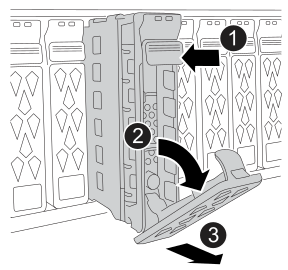

= 步骤 1：准备更换驱动器
:allow-uri-read: 

== 步骤 1：准备更换驱动器

通过确保驱动器出现故障、确认您具有受支持的替换驱动器、确保您具有 SANtricity System Manager 访问权限、采取静电放电预防措施以及物理定位故障驱动器来准备驱动器更换。

.步骤
. 如果 SANtricity System Manager 中的恢复 Guru 已通知您驱动器出现 _ 即将发生故障 _ ，但驱动器尚未出现故障，请按照恢复 Guru 中的说明对驱动器进行故障转移。
. 请确保您有一个适合您的存储系统配置的替换驱动器。
+
如有需要，您可以使用 SANtricity System Manager 确认：

+
.. 选择 *Hardware* > *Drives*。
.. 在图形上选择出现故障的驱动器以显示其上下文菜单，然后选择 *查看设置*。
.. 确认替代驱动器的容量等于或大于要更换的驱动器，并且具有您期望的功能。
+
例如，如果您要更换具有安全功能的驱动器，请确保更换的驱动器也具有安全功能。

. 确保您有一个带有浏览器的管理站，可以访问任一控制器的 SANtricity System Manager。
+
要打开 System Manager 界面，请将浏览器指向控制器的域名或 IP 地址之一。

. 在处理和安装驱动器期间防止静电放电（ESD）：
+
** 请确保配备静电放电 (ESD) 腕带。
+
始终佩戴防静电腕带，将其接地到您的存储系统机箱上未上漆的表面上。如果没有腕带，请在处理驱动器之前触摸存储系统机箱上未上漆的表面。

** 请将驱动器放在 ESD 袋中，直到准备好安装为止。
** 用手打开 ESD 袋或用剪刀剪掉顶部。请勿将金属工具或刀片插入 ESD 袋中。
** 请确保工作表面平整无静电。
** 保留 ESD 袋和任何包装材料以退回故障驱动器，或在运输驱动器时使用经批准的包装。
** 避免磁场。使驱动器远离磁性设备。
+
磁场可能会破坏驱动器上的所有数据，并且发生原因会对驱动器电路造成不可修复的损坏。

. 在处理和安装驱动器过程中避免物理损坏：
+

CAUTION: 驱动器易碎；驱动器处理不当是驱动器故障的主要原因。

+
** 在拆卸，安装或搬运驱动器时，请始终用双手。
** 切勿将驱动器强行推入驱动器托架。始终使用轻柔而坚定的压力来完全接合驱动器闩锁。
** 将驱动器放置在缓冲表面上，切勿将驱动器堆叠在彼此之上。
** 请勿将驱动器撞到其他表面。

. 您可以打开存储系统位置（蓝色）LED（位于存储系统和两个控制器的正面），以帮助物理定位受影响的存储系统。使用 SANtricity System Manager，选择*硬件* > *控制器和组件*，选择*控制器架*选项卡，然后从上下文菜单中选择*打开定位灯*。
. 如果需要，您可以使故障驱动器的注意（琥珀色）LED 闪烁，从而在存储系统中物理定位故障驱动器。使用 SANtricity System Manager，选择*硬件* > *驱动器*，在图形上选择出现故障的驱动器以显示其上下文菜单，然后选择*打开定位灯*。
+

NOTE: 您必须从存储系统正面卸下挡板，才能看到驱动器 LED。

== 步骤 2：更换驱动器

将出现故障的驱动器更换为新驱动器。

NOTE: 卸下故障驱动器后，应尽快安装更换驱动器。

.步骤
. 如果尚未卸下，请从存储系统正面卸下挡板。
. 删除故障驱动器：
+

NOTE: 如果您意外删除了活动驱动器，请至少等待 60 秒，然后重新安装它。有关恢复操作步骤，请参阅存储管理软件。

+

+
[cols="1,4"]
|===

 a| 
image::../media/icon_round_1.png[标注编号 1]
 a| 
按下驱动器面板上的黑色释放按钮以打开凸轮手柄。

 a| 
image::../media/icon_round_2.png[标注编号 2]
 a| 
向下旋转凸轮手柄，使驱动器与中间背板脱离。

 a| 
image::../media/icon_round_3.png[标注编号 3]
 a| 
.. 使用凸轮手柄将驱动器部分滑出驱动器舱。
.. 等待 60 秒，让驱动器停止旋转。
.. 用两只手将驱动器从驱动器舱中完全取出。

|===
. 将驱动器放在远离磁场的防静电缓冲表面上。
. 等待 60 秒，以便系统软件识别驱动器已被删除。
. 拆开更换驱动器，并将其放置在存储系统附近的平坦无静电表面上。
+
保存包装材料，以便在退回故障驱动器时使用。

. 插入更换驱动器：
+
.. 打开凸轮把手。
.. 用两只手将替换驱动器插入打开的驱动器舱，用力推直至驱动器停止。
.. 合上凸轮手柄，使驱动器完全固定在中间平面上，凸轮手柄卡入到位。
+
请务必慢慢关闭凸轮手柄，使其与驱动器表面正确对齐。

+
正确插入驱动器时，驱动器上的绿色 LED 亮起。

== 步骤 3：完成驱动器更换

确认更换驱动器正常工作，并确保驱动器重建已开始。

.步骤
. 通过检查 LED 行为来确认更换驱动器是否正常工作，如果没有，请采取适当的纠正措施。
+

NOTE: 首次插入驱动器时，其注意 LED 可能已打开。但是，如果更换驱动器正常工作，LED 应在一分钟内熄灭。

+
[cols="1,2"]
|===
| 如果更换驱动器 LED 的行为显示... | 操作 

 a| 
电源 LED 亮起或闪烁，注意 LED 熄灭
 a| 
更换驱动器工作正常。

转至下一步。

 a| 
电源 LED 熄灭
 a| 
驱动器可能未正确安装。

.. 卸下驱动器，等待 60 秒，然后重新安装。
.. 如果 SANtricity 系统管理器中的恢复 Guru 仍显示问题描述，请选择 * 重新检查 * 以确保问题已解决。

 a| 
注意 LED 指示灯亮起
 a| 
新驱动器可能有缺陷。

.. 用另一个新驱动器替换新驱动器。
.. 如果 SANtricity 系统管理器中的恢复 Guru 仍显示问题描述，请选择 * 重新检查 * 以确保问题已解决。

|===
. 如果 SANtricity System Manager 中的 Recovery Guru 指示驱动器重建未自动开始，请在 NetApp 支持人员或 Recovery Guru 的指示下手动开始重建，并使用以下步骤：
+

NOTE: 根据您的配置，控制器可能会自动将数据重建到新驱动器。如果存储系统使用热备用驱动器，则在将数据复制到替换驱动器之前，控制器可能需要在热备用驱动器上执行完整的重建。此重建过程会增加完成此操作步骤所需的时间。

+
.. 选择 *Hardware* > *Drive*。
.. 在图形上选择替换驱动器以显示其上下文菜单，然后选择 *Reconstruct*。
.. 确认要执行此操作。
+
驱动器重建完成后，卷组将处于最佳状态。

. 重新安装挡板。

== 步骤 4：将故障部件退回 NetApp

如套件附带的 RMA 说明中所述，将故障部件退回 NetApp。有关更多信息，请参阅 https://mysupport.netapp.com/site/info/rma["零件退货和更换"]页面。
