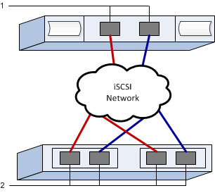

= 记录 iSCSI 配置
:allow-uri-read: 
:icons: font
:imagesdir: ../media/

[role="lead"]
您可以生成并打印此页面的 PDF ，然后使用以下工作表记录 iSCSI 存储配置信息。要执行配置任务，您需要此信息。

== 建议的配置

建议的配置包括两个启动程序端口和四个目标端口以及一个或多个 VLAN 。

== 目标 IQN

|===
| 标注编号 | 目标端口连接 | IQN 

 a| 
2.
 a| 
目标端口
 a| 

|===

== 正在映射主机名

|===
| 标注编号 | 主机信息 | 名称和类型 

 a| 
1.
 a| 
正在映射主机名
 a| 

 a| 
 a| 
主机操作系统类型
 a| 

|===