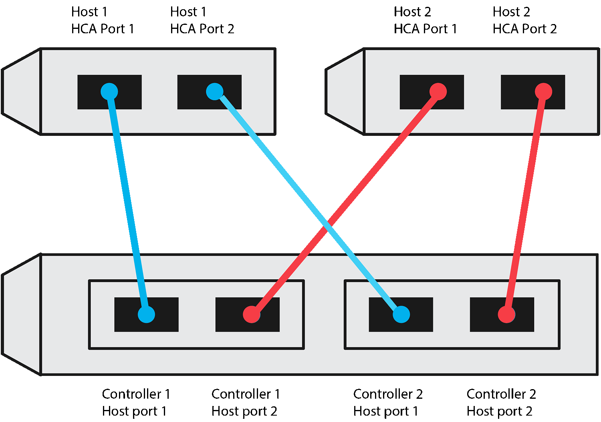

= 记录您的基于 RoCE 的 NVMe 配置
:icons: font
:imagesdir: ../media/

[role="lead"]
您可以生成并打印此页面的 PDF ，然后使用以下工作表记录基于 RoCE 的 NVMe 存储配置信息。要执行配置任务，您需要此信息。

== 直连拓扑

在直连拓扑中，一个或多个主机直接连接到子系统。在 SANtricity OS 11.50 版本中，我们支持从每个主机到子系统控制器的单个连接，如下所示。在此配置中，每个主机的一个 HCA （主机通道适配器）端口应与所连接的 E 系列控制器端口位于同一子网中，但与另一个 HCA 端口位于不同的子网中。

满足这些要求的示例配置包括四个网络子网，如下所示：

* 子网 1 ：主机 1 HCA 端口 1 和控制器 1 主机端口 1
* 子网 2 ：主机 1 HCA 端口 2 和控制器 2 主机端口 1
* 子网 3 ：主机 2 HCA 端口 1 和控制器 1 主机端口 2
* 子网 4 ：主机 2 HCA 端口 2 和控制器 2 主机端口 2

== 交换机连接拓扑

在网络结构拓扑中，使用一个或多个交换机。请参见 https://mysupport.netapp.com/matrix["NetApp 互操作性表工具"^] 有关支持的交换机的列表。

image::../media/nvmeof_switch_connect.gif[nvmeof 交换机连接]

== 主机标识符

找到并记录每个主机上的启动程序 NQN 。

|===
| 主机端口连接 | 软件启动程序 NQN 

 a| 
主机（启动程序） 1.
 a| 

 a| 
 a| 

 a| 
主机（启动程序） 2.
 a| 

 a| 
 a| 

 a| 
 a| 

|===

== 目标 NQN

记录存储阵列的目标 NQN 。

|===
| 阵列名称 | 目标 NQN 

 a| 
阵列控制器（目标）
 a| 

|===

== 目标 NQN

记录阵列端口要使用的 NQN 。

|===
| 阵列控制器（目标）端口连接 | NQN 

 a| 
控制器 A ，端口 1
 a| 

 a| 
控制器 B ，端口 1
 a| 

 a| 
控制器 A ，端口 2
 a| 

 a| 
控制器 B ，端口 2
 a| 

|===

== 正在映射主机名

NOTE: 映射主机名会在工作流期间创建。

|===

 a| 
正在映射主机名
 a| 

 a| 
主机操作系统类型
 a| 

|===