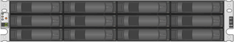

= E 系列磁盘架类型
:allow-uri-read: 
:icons: font
:imagesdir: ../media/

[role="lead"]
E 系列系统具有多种不同的磁盘架大小。

|===
| 磁盘架类型 | 插图 

 a| 
* DE212C ： *

* 2u12 （ 2 个机架单元； 12 个驱动器）
* 3.5 英寸 HDD 和 / 或 2.5 英寸 SSD （带适配器）
* 仅限 E2800 控制器

 a| 

 a| 
* DE224C ： *

* 2u24 （ 2 个机架单元； 24 个驱动器）
* 2.5 英寸 HDD 和 / 或 2.5 英寸 SSD 驱动器
* E2800 ， EF280 ， E5700 和 EF570 控制器

 a| 
image:../media/e2824_front.gif[""]

 a| 
* DE460C ： *

* 4u60 （ 4 个机架单元； 60 个驱动器）
* 3.5 英寸和 2.5 英寸驱动器（ NL-SAS ， SAS 和 SSD ）
* E2800 和 E5700 控制器

 a| 
image:../media/de460c.gif[""]

 a| 
* NE224 ： *

* 2u24 （ 2 个机架单元； 24 个驱动器）
* 2.5 英寸 NVMe SSD 驱动器
* EF300 和 EF600 控制器

 a| 
image:../media/ne224.gif[""]

|===