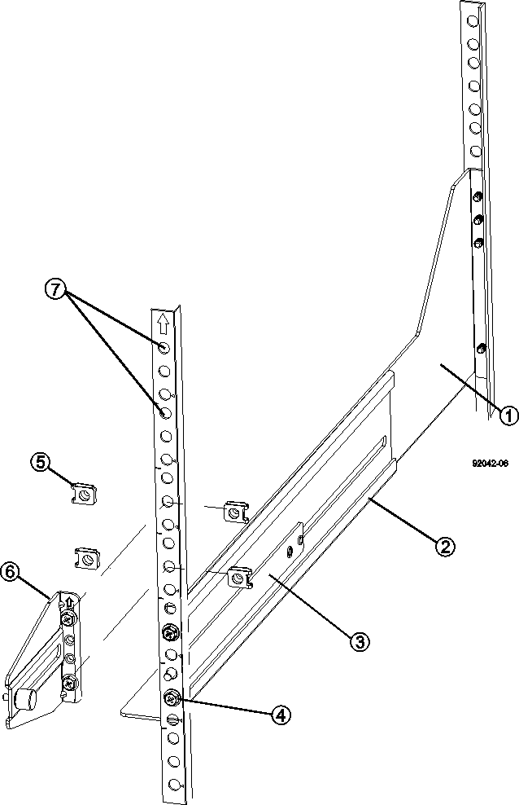

= 完成机柜安装
:allow-uri-read: 
:icons: font
:imagesdir: ../media/

[role="lead"]
移动机柜后，降低水平垫和稳定性支脚，重新安装已卸下的组件，安装其他所需组件并将机柜连接到电源。

== 第 1 步：降低水平脚和稳定性脚

您可以通过调整机柜的支脚来稳定机柜。水平垫可从脚轮上支撑机柜。稳定性支脚可防止机柜在放置到永久位置后发生倒落。

.步骤
. 降低水平垫，将机柜从脚轮上支撑住。
+
水平垫位于机柜的每个下角附近。

. 确保机柜尽可能水平。
+
下图显示了稳定性支脚和水平支脚的特写视图。

+
image::../media/83000_08.gif[83000 08.]

+
|===

 a| 
1.
 a| 
平衡支脚

 a| 
2.
 a| 
稳定支脚

|===

== 第 2 步：重新安装托盘

移动机柜后，您可以将托盘重新安装在其原始位置。

CAUTION: _Do not_ 将以下托盘安装在机柜顶部的机头上。完全填充后，每个托盘的重量均超过 100 千克（ 220 磅）。如果安装在机柜顶部，则这些托盘会创建一个顶部重物的机柜，而该机柜很容易变得不平衡： E2660 ， E2660 ， E2760 ， E5460 ， E5560 ， 和 E5660 控制器驱动器托盘以及 DE6600 驱动器托盘

.步骤
. 将所有托盘重新安装在机柜中的原始位置。
+

CAUTION: * 人身伤害风险 * —空托盘重约 56.7 千克（ 125 磅）。安全移动空托盘需要三个人如果托盘中装有组件，则需要使用机械升降机来安全移动托盘

. 将所有组件重新安装到托盘中的原始位置。
+
为了防止地址冲突和数据访问丢失，请更换同一托盘中和托盘中同一位置的所有组件

. 将所有缆线重新安装到托盘中的原始位置。
. 将接口缆线连接到机柜。
. 将主电源线从机柜连接到两个外部电源。目前，请勿 _ 插入电源线。

== 第 3 步：安装缆线卷轴和捆扎带

重新安装托盘后，安装缆线卷轴和捆扎带。缆线卷轴和捆扎带可容纳控制器和托盘的多余缆线长度和缆线布线。

.步骤
. 沿垂直配电插座的两侧安装缆线卷轴和捆扎带。
+
image::../media/83003_01_dwg_3040_cable_spools.gif[83003 01 dwg 3040 缆线卷轴]

+
|===

 a| 
1.
 a| 
绑定位置

 a| 
2.
 a| 
缆线轴

|===

== 第 4 步：安装其他托盘

如果需要，您可以安装其他托盘。您必须覆盖托盘未使用的位置，以确保气流正确。

.步骤
. 如果必须安装其他托盘，请为这些托盘安装安装安装硬件。
. 如果机柜前部未完全装满托盘，请使用前面板套件覆盖已安装托盘上方或下方的空空间。
+
必须覆盖空空间，这样才能保持机柜中的正确气流。

. 打开托盘电源。

== 第 5 步：安装其他安装导轨

[role="lead"]
如果您要安装单独发售的控制器驱动器托盘或驱动器托盘（尚未安装在机柜中），则可能需要在机柜中安装额外的安装导轨。

.步骤
. 确定安装导轨的位置。
+
** * 现有托盘上方 * —将安装导轨放置在机柜中顶部托盘上方。
** * 在现有托盘下方 * - 放置具有足够间隙的安装导轨以容纳要安装的托盘：
+
*** 2U 控制器驱动器托盘或驱动器托盘为 8.9 厘米（ 3.5 英寸）
*** 对于 4U 控制器驱动器托盘或驱动器托盘，为 17.8 厘米（ 7 英寸）

. 使用右前垂直支架和左前垂直支架上的测量标记将安装导轨连接到机柜两侧的相同位置。
+

+
|===

 a| 
1.
 a| 
前部可调整导轨

 a| 
2.
 a| 
后部可调整导轨

 a| 
3.
 a| 
调整板和螺钉

 a| 
4.
 a| 
导轨安装 M5×10 毫米螺钉

 a| 
5.
 a| 
夹紧螺母

 a| 
6.
 a| 
后固定支架

 a| 
7.
 a| 
垂直支持

|===
+

NOTE: 如果导轨安装在 3040 机柜中，则不会使用卡夹螺母和后固定支架。

. 将后部可调整导轨放置在垂直支架上。
. 在后部可调整导轨上，对齐垂直支架孔前面的可调整导轨孔。
. 连接两个 M5×10 毫米螺钉。
+
.. 通过垂直支撑导轨和后部可调整导轨连接螺钉。
.. 拧紧螺钉。

. 将前部可调整导轨放置在垂直支架上。
. 在前部可调整导轨上，对齐垂直支架孔前面的可调整导轨孔。
. 连接两个 M5×10 毫米螺钉。
+
.. 将一个螺钉穿过垂直支撑导轨和前可调整导轨的底部孔。
.. 将一个螺钉穿过垂直支撑导轨，并连接到前可调整导轨上三个孔的中间。
.. 拧紧螺钉。

+

NOTE: 其余两个螺钉孔用于安装托盘

. 重复步骤 3 到步骤 8 ，将第二个导轨连接到机柜另一侧。
. 按照适用的托盘安装说明安装每个托盘。
. 选择以下选项之一：
+
** 如果托盘的所有位置均已满，请打开托盘的电源。
** 如果托盘的所有位置都未满，请使用前面板套件覆盖已安装托盘上方或下方的空位。

== 第 6 步：将机柜连接到电源

要完成机柜安装，请打开机柜组件的电源。

.关于此任务
在托盘执行开机操作步骤时，托盘正面和背面的 LED 将闪烁。根据您的配置，完成启动操作步骤可能需要几分钟的时间。

.步骤
. 关闭机柜中所有组件的电源。
. 将所有 12 个断路器转到其 OFF （ DOWN ）位置。
. 将六个 NEMA L6-30 连接器（美国和加拿大）中的每个连接器或六个 IEC 60309 连接器（全球通用，美国和加拿大除外）插入可用的电源插座。
+

NOTE: 您必须将每个 PDU 连接到机柜外的一个独立电源。

. 将所有 12 个断路器转至其 ON （向上）位置。
+
image::../media/83002_05_dwg_3040_cabinet_pdus.gif[83002 05 dwg 3040 机柜 PDU]

+
|===

 a| 
1.
 a| 
断路器

 a| 
2.
 a| 
电源插座

 a| 
3.
 a| 
电源输入框

|===
. 打开机柜中所有驱动器托盘的电源。
+

NOTE: 打开驱动器托盘后，请等待 30 秒，然后再打开控制器驱动器托盘的电源。

. 打开驱动器托盘后，请等待 30 秒，然后打开机柜中所有控制器驱动器托盘的电源。

.结果
机柜安装完成。您可以恢复正常操作。
