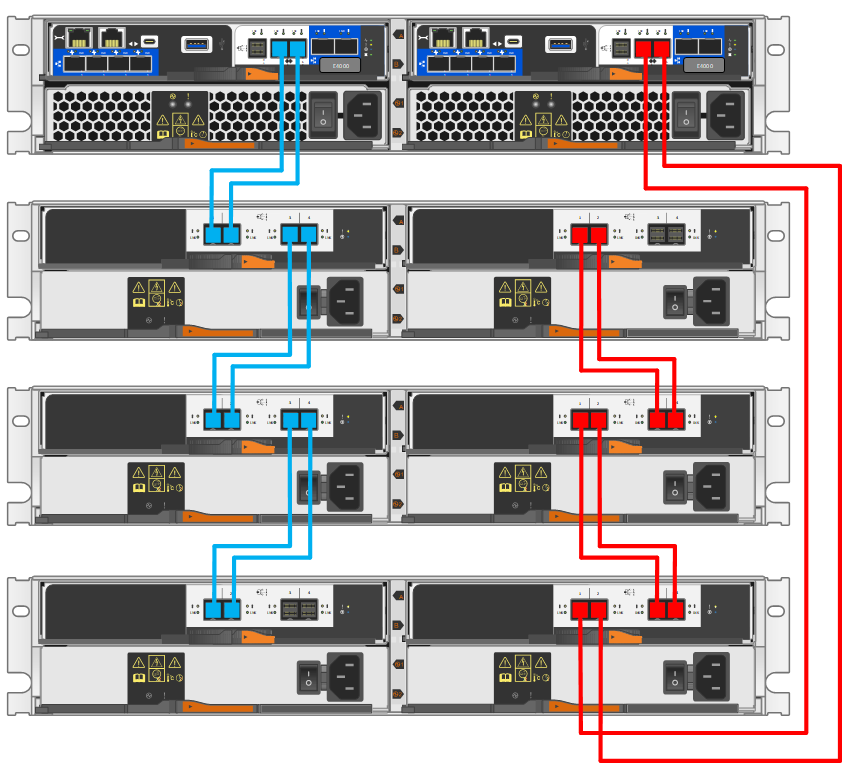
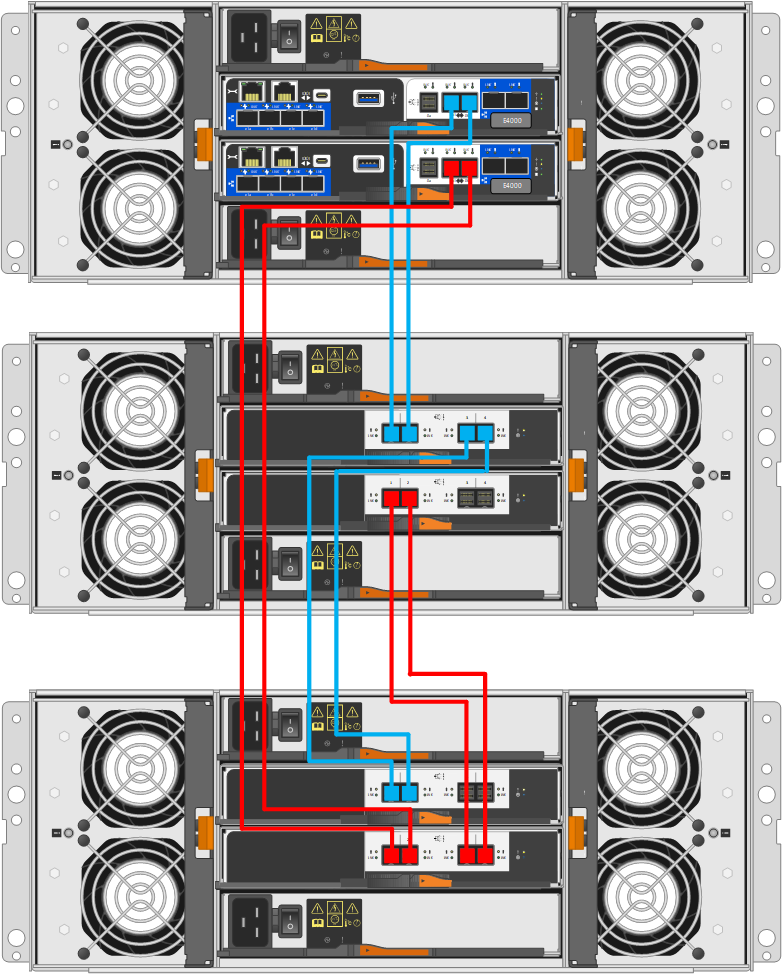

= 使用缆线将控制器架连接到驱动器架(E系列)
:allow-uri-read: 
:icons: font
:imagesdir: ../media/

[role="lead"]
您必须将控制器架中的每个控制器连接到驱动器架中的 I/O 模块（ IOM ）。

此过程适用于 IOM12、IOM12B 和 IOM12C 驱动器架。

NOTE: 只有SANtricity OS 11.70.2及更高版本才支持IOM12C模块。在安装或升级到IOM12C之前、请确保已更新控制器的固件。

NOTE: 此操作步骤 适用于同类磁盘架 IOM 热插拔或更换。这意味着，您只能将 IOM12 模块更换为另一个 IOM12 模块，或者将 IOM12C 模块更换为另一个 IOM12C 模块。（您的磁盘架可以有两个 IOM12 模块，也可以有两个 IOM12C 模块。）

如果要使用缆线将旧控制器架连接到 DE212C ， DE224C 或 DE460 ，请参见 https://mysupport.netapp.com/ecm/ecm_download_file/ECMLP2859057["将 IOM 驱动器架添加到现有 E27XX ， E56XX 或 EF560 控制器架"^]。

== 为 E2800 和 E5700 布线

以下信息适用场景 为 E2800 ， E2800B ， EF280 ， E5700 ， EF5700B 布线， 或 EF570 控制器架连接到 DE212C ， DE224C 或 DE460 驱动器架。

[role="tabbed-block"]
====
.可容纳12个驱动器或24个驱动器的磁盘架
--
您可以使用缆线将控制器架连接到一个或多个 12 驱动器或 24 驱动器磁盘架。

下图显示了控制器架和驱动器架的表示形式。要查找您的型号上的端口，请参见 https://hwu.netapp.com/Controller/Index?platformTypeId=2357027["Hardware Universe"^]。

image::../media/12_24_cabling.png[一个控制器架和 12 驱动器或 24 驱动器架]

--
.可容纳60个驱动器的磁盘架
--
您可以使用缆线将控制器架连接到一个或多个 60 驱动器磁盘架。

下图显示了控制器架和驱动器架的表示形式。要查找您的型号上的端口，请参见 https://hwu.netapp.com/Controller/Index?platformTypeId=2357027["Hardware Universe"^]。

image::../media/60_cabling.png[一个控制器架和 60 个驱动器架]

--
====

== 为EF300和EF600布线

以下信息适用场景使用缆线将 EF300 ， EF600 ， EF300C 或 EF600C 控制器架连接到 DE212C ， DE224C 或 DE460 驱动器架。

.开始之前
在为EF300或EF600布线之前、请确保固件已更新到最新版本。要更新固件，请按照中的说明进行操作 link:../upgrade-santricity/index.html["升级 SANtricity OS"^]。

[role="tabbed-block"]
====
.可容纳12个驱动器或24个驱动器的磁盘架
--
您可以使用缆线将控制器架连接到一个或多个 12 驱动器或 24 驱动器磁盘架。

下图显示了控制器架和驱动器架的表示形式。要查找您的型号上的端口，请参见 https://hwu.netapp.com/Controller/Index?platformTypeId=2357027["Hardware Universe"^]。

image::../media/ef_to_de224c_four_shelves.png[一个控制器架和 12 驱动器或 24 驱动器架]

--
.可容纳60个驱动器的磁盘架
--
您可以使用缆线将控制器架连接到一个或多个 60 驱动器磁盘架。

下图显示了控制器架和驱动器架的表示形式。要查找您的型号上的端口，请参见 https://hwu.netapp.com/Controller/Index?platformTypeId=2357027["Hardware Universe"^]。

image::../media/ef_to_de460c.png[一个控制器架和 60 个驱动器架]

--
====

== 为 E4000 布线

以下信息是通过适用场景将 E4000 控制器架连接到 DE212C ， DE224C 或 DE460 驱动器架的信息。

[role="tabbed-block"]
====
.可容纳12个驱动器的磁盘架
--
您可以使用缆线将控制器架连接到一个或多个 12 驱动器磁盘架。

--
.可容纳60个驱动器的磁盘架
--
您可以使用缆线将控制器架连接到一个或多个 60 驱动器磁盘架。

--
====