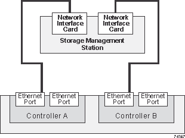

= 管理站的以太网布线 - E-Series
:allow-uri-read: 
:icons: font
:imagesdir: ../media/

[role="lead"]
您可以将存储系统连接到以太网网络，以便进行带外存储阵列管理。所有存储阵列管理连接都必须使用以太网缆线。

[NOTE]
====
某些存储系统在每个控制器上只有一个带外 Ethernet 管理端口。

有关特定于存储系统的缆线连接说明，请参阅 link:../getting-started/getup-run-concept.html["E系列快速入门"^] 并单击特定存储系统的链接。

====

== 直接拓扑

直接拓扑可将控制器直接连接到以太网网络。

您必须在每个控制器上连接管理端口 1 以进行带外管理，并保留端口 2 以供技术支持访问存储阵列。

.直接存储管理连接

== 网络结构拓扑

网络结构拓扑使用交换机将控制器连接到以太网网络。

您必须在每个控制器上连接管理端口 1 以进行带外管理，并保留端口 2 以供技术支持访问存储阵列。

.光纤存储管理连接
image::../media/74110.gif[光纤存储管理连接]
