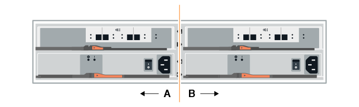

= 热添加驱动器架
:allow-uri-read: 
:icons: font
:imagesdir: ../media/

[role="lead"]
您可以在存储系统的其他组件仍通电的情况下添加新驱动器架。您可以配置，重新配置，添加或重新定位存储系统容量，而不会中断用户对数据的访问。

由于此操作步骤的复杂性，建议执行以下操作：

* 开始操作步骤之前，请阅读所有步骤。
* 确保热添加驱动器架是您所需的操作步骤。

此 操作步骤 适用场景 会将 DE212C ， DE224C 或 DE460C 驱动器架热添加到 E2800 ， E2800B ， EF280 ， E5700 ， E5700B ， EF570 或 EF300 控制器架。

此 操作步骤 适用场景 IOM12 和 IOM12B 驱动器架。

NOTE: 只有SANtricity OS 11.07.02及更高版本才支持IOM12B模块。在安装或升级到IOM12B之前、请确保已更新控制器的固件。

NOTE: 此操作步骤 适用于同类磁盘架 IOM 热插拔或更换。这意味着，您只能将 IOM12 模块更换为另一个 IOM12 模块，或者将 IOM12B 模块更换为另一个 IOM12B 模块。（您的磁盘架可以有两个 IOM12 模块，也可以有两个 IOM12B 模块。）

如果要使用缆线将旧控制器架连接到 DE212C ， DE224C 或 DE460 ，请参见 https://mysupport.netapp.com/ecm/ecm_download_file/ECMLP2859057["将 IOM 驱动器架添加到现有 E27XX ， E56XX 或 EF560 控制器架"^]。

NOTE: 要保持系统完整性，您必须严格按照显示的顺序执行操作步骤。

== 第 1 步：准备添加驱动器架

要准备热添加驱动器架，您必须检查是否存在严重事件并检查 IOM 的状态。

.开始之前
* 存储系统的电源必须能够满足新驱动器架的电源要求。有关驱动器架的电源规格，请参见 https://hwu.netapp.com/Controller/Index?platformTypeId=2357027["Hardware Universe"^]。
* 现有存储系统的布线模式必须与此操作步骤中显示的适用方案之一匹配。

.步骤
. 在 SANtricity 系统管理器中，选择 * 支持 * > * 支持中心 * > * 诊断 * 。
. 选择 * 收集支持数据 * 。
+
此时将显示收集支持数据对话框。

. 单击 * 收集 * 。
+
此文件将保存在浏览器的 "Downloads" 文件夹中，名为 support-data.7z 。数据不会自动发送到技术支持。

. 选择 * 支持 * > * 事件日志 * 。
+
"Event Log" 页面将显示事件数据。

. 选择 * 优先级 * 列的标题，将严重事件排序到列表顶部。
. 查看系统严重事件以了解过去两到三周内发生的事件，并验证近期发生的任何严重事件是否已解决或以其他方式解决。
+

NOTE: 如果在过去两到三周内发生未解决的严重事件，请停止操作步骤并联系技术支持。只有在解决了问题描述后，才能继续操作步骤。

. 选择 * 硬件 * 。
. 选择 * IOM （ ESM ） * 图标。
+
image::../media/sam1130_ss_hardware_iom_icon.gif[sam1130 ss hardware IOM 图标]

+
此时将显示磁盘架组件设置对话框，并选择了 * IOM （ ESM ） * 选项卡。

. 确保为每个 IOM/ESM 显示的状态为 _optimal_ 。
. 单击 * 显示更多设置 * 。
. 确认存在以下条件：
+
** 检测到的 ESM/IOM 数量与系统中安装的 ESM/IOM 数量以及每个驱动器架的 ESM/IOM 数量匹配。
** 两个 ESM/IOM 均显示通信正常。
** DE212C ， DE224C 和 DE460C 驱动器架的数据速率为 12 Gb/ 秒，其他驱动器托盘的数据速率为 6 Gb/ 秒。

== 第 2 步：安装驱动器架并接通电源

您可以安装新的驱动器架或先前安装的驱动器架，打开电源并检查是否存在需要注意的任何 LED 。

.步骤
. 如果要安装的驱动器架先前已安装在存储系统中，请卸下这些驱动器。这些驱动器必须稍后在此操作步骤中安装一个。
+
如果您要安装的驱动器架的安装历史记录未知，则应假定该驱动器架先前已安装在存储系统中。

. 将驱动器架安装在用于存放存储系统组件的机架中。
+

NOTE: 有关物理安装和电源布线的完整操作步骤，请参见适用于您的型号的安装说明。您的型号的安装说明包含一些注释和警告，您必须考虑这些注释和警告才能安全地安装驱动器架。

. 打开新驱动器架的电源，并确认驱动器架上的琥珀色警示 LED 未亮起。如果可能，请先解决所有故障情况，然后再继续使用此操作步骤。

== 第 3 步：为系统布线

根据您使用缆线连接的是 E2800 和 E5700 存储系统还是 EF300 存储系统，选择以下选项之一。

* <<Option 1: Connect the drive shelf for E2800 and E5700>>
* <<Option 2: Connect the drive shelf for EF300>>

如果要使用缆线将旧控制器架连接到 DE212C ， DE224C 或 DE460 ，请参见 https://mysupport.netapp.com/ecm/ecm_download_file/ECMLP2859057["将 IOM 驱动器架添加到现有 E27XX ， E56XX 或 EF560 控制器架"^]。

=== 选项 1 ：连接 E2800 和 E5700 的驱动器架

将驱动器架连接到控制器 A ，确认 IOM 状态，然后将驱动器架连接到控制器 B

.步骤
. 将驱动器架连接到控制器 A
+
下图显示了一个附加驱动器架与控制器 A 之间的连接示例要查找您的型号上的端口，请参见 https://hwu.netapp.com/Controller/Index?platformTypeId=2357027["Hardware Universe"^]。

+
image::../media/hot_e5700_0.png[热 e5700 0]

+
image::../media/hot_e5700_1.png[热 e5700 1.]

. 在 SANtricity 系统管理器中，单击 * 硬件 * 。
+

NOTE: 此时，在操作步骤中，您只有一条指向控制器架的活动路径。

. 根据需要向下滚动以查看新存储系统中的所有驱动器架。如果未显示新驱动器架，请解决连接问题描述。
. 选择新驱动器架的 * ESM/IOM* 图标。
+
image::../media/sam1130_ss_hardware_iom_icon.gif[sam1130 ss hardware IOM 图标]

+
此时将显示 * 磁盘架组件设置 * 对话框。

. 在 * 磁盘架组件设置 * 对话框中选择 * ESM/IOM* 选项卡。
. 选择 * 显示更多选项 * ，然后验证以下内容：
+
** 列出了 IOM/ESM A 。
** 对于 SAS-3 驱动器架，当前数据速率为 12 Gbps 。
** 卡通信正常。

. 断开控制器 B 的所有扩展缆线
. 将驱动器架连接到控制器 B
+
下图显示了一个附加驱动器架与控制器 B 之间的连接示例要查找您的型号上的端口，请参见 https://hwu.netapp.com/Controller/Index?platformTypeId=2357027["Hardware Universe"^]。

+
image::../media/hot_e5700_2.png[热的 e5700 2.]

. 如果尚未选中此选项，请在 * 磁盘架组件设置 * 对话框中选择 * ESM/IOM* 选项卡，然后选择 * 显示更多选项 * 。验证卡通信是否为 * 是 * 。
+

NOTE: 最佳状态表示已解决与新驱动器架相关的冗余丢失错误，并且存储系统已稳定。

=== 选项 2 ：连接 EF300 的驱动器架

将驱动器架连接到控制器 A ，确认 IOM 状态，然后将驱动器架连接到控制器 B

.开始之前
* 您已将固件更新到最新版本。要更新固件，请按照中的说明进行操作 link:../upgrade-santricity/index.html["升级 SANtricity OS"]。

.步骤
. 从堆栈中最后一个磁盘架的 IOM12 端口 1 和 2 断开 A 侧控制器缆线，然后将其连接到新磁盘架的 IOM12 端口 1 和 2 。
+

. 将缆线从新磁盘架连接到 A 侧 IOM12 端口 3 和 4 ，再连接到上一个磁盘架的 IOM12 端口 1 和 2 。
+
下图显示了附加驱动器架与上一个驱动器架之间的一端连接示例。要查找您的型号上的端口，请参见 https://hwu.netapp.com/Controller/Index?platformTypeId=2357027["Hardware Universe"^]。

+
image::../media/hot_ef_0.png[热 f 0]

+
image::../media/hot_ef_1.png[热备份 1]

. 在 SANtricity 系统管理器中，单击 * 硬件 * 。
+

NOTE: 此时，在操作步骤中，您只有一条指向控制器架的活动路径。

. 根据需要向下滚动以查看新存储系统中的所有驱动器架。如果未显示新驱动器架，请解决连接问题描述。
. 选择新驱动器架的 * ESM/IOM* 图标。
+
image::../media/sam1130_ss_hardware_iom_icon.gif[sam1130 ss hardware IOM 图标]

+
此时将显示 * 磁盘架组件设置 * 对话框。

. 在 * 磁盘架组件设置 * 对话框中选择 * ESM/IOM* 选项卡。
. 选择 * 显示更多选项 * ，然后验证以下内容：
+
** 列出了 IOM/ESM A 。
** 对于 SAS-3 驱动器架，当前数据速率为 12 Gbps 。
** 卡通信正常。

. 从 IOM12 端口 1 和 IOM12 端口 2 断开 B 侧控制器缆线与堆栈中前一个磁盘架的连接，然后将其连接到新磁盘架 IOM12 端口 1 和 2 。
. 将新磁盘架上 B 侧 IOM12 端口 3 和 4 的缆线连接到上一个最后一个磁盘架 IOM12 端口 1 和 2 。
+
下图显示了附加驱动器架与上一个驱动器架之间 B 侧的连接示例。要查找您的型号上的端口，请参见 https://hwu.netapp.com/Controller/Index?platformTypeId=2357027["Hardware Universe"^]。

+
image::../media/hot_ef_2.png[热 f 2.]

. 如果尚未选中此选项，请在 * 磁盘架组件设置 * 对话框中选择 * ESM/IOM* 选项卡，然后选择 * 显示更多选项 * 。验证卡通信是否为 * 是 * 。
+

NOTE: 最佳状态表示已解决与新驱动器架相关的冗余丢失错误，并且存储系统已稳定。

== 第 4 步：完成热添加

您可以通过检查是否存在任何错误并确认新添加的驱动器架使用最新固件来完成热添加。

.步骤
. 在 SANtricity 系统管理器中，单击 * 主页 * 。
. 如果页面中央顶部显示标记为 * 从问题中恢复 * 的链接，请单击该链接，然后解决 Recovery Guru 中指示的任何问题。
. 在 SANtricity 系统管理器中，单击 * 硬件 * ，然后根据需要向下滚动以查看新添加的驱动器架。
. 对于先前安装在其他存储系统中的驱动器，请一次向新安装的驱动器架添加一个驱动器。请等待识别每个驱动器，然后再插入下一个驱动器。
+
存储系统识别驱动器后， * 硬件 * 页面中的驱动器插槽表示为蓝色方框。

. 选择 * 支持 * > * 支持中心 * > * 支持资源 * 选项卡。
. 单击 * 软件和固件清单 * 链接，然后检查新驱动器架上安装的 IOM/ESM 固件和驱动器固件版本。
+

NOTE: 您可能需要向下滚动此页面才能找到此链接。

. 如有必要，请升级驱动器固件。
+
除非禁用了升级功能，否则 IOM/ESM 固件会自动升级到最新版本。

热添加操作步骤已完成。您可以恢复正常操作。
