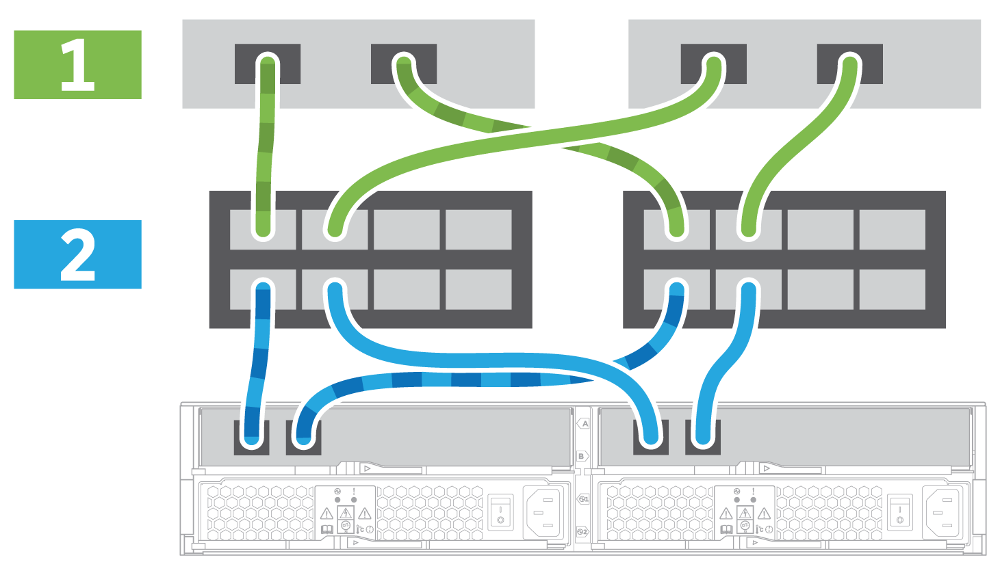

= 完成存储系统设置和配置
:allow-uri-read: 
:icons: font
:imagesdir: ../media/

[role="lead"]
了解如何使用缆线将控制器连接到您的网络并完成存储系统设置和配置。

== 第 1 步：为数据主机布线

根据您的网络拓扑为系统布线。

NOTE: 如果您使用的是 AIX ® ，则必须先在主机上安装 E 系列多路径驱动程序，然后再将其连接到阵列。

=== 选项 1 ：直连拓扑

以下示例显示了使用直连拓扑连接到数据主机的布线。

|===

 a| 
image:../media/2U_DirectTopology.png[""]
 a| 
. 将每个主机适配器直接连接到控制器上的主机端口。

|===

=== 选项 2 ：网络结构拓扑

以下示例显示了使用网络结构拓扑连接到数据主机的情况。

|===

 a| 

 a| 
. 将每个主机适配器直接连接到交换机。
. 将每个交换机直接连接到控制器上的主机端口。

|===

== 第 2 步：连接并配置管理连接

您可以使用以下两个选项之一配置控制器管理端口：使用 DHCP 服务器或使用静态 IP 地址。

=== 选项 1 ： DHCP 服务器

了解如何使用 DHCP 服务器配置管理端口。

.开始之前
* 将 DHCP 服务器配置为将 IP 地址，子网掩码和网关地址关联为每个控制器的永久租约。
* 从网络管理员处获取将用于连接到存储系统的已分配 IP 地址。

.步骤
. 将以太网缆线连接到每个控制器的管理端口，并将另一端连接到网络。
+
|===

 a| 
image:../media/cable_ethernet_inst-hw-e2800-e5700.png[""]
 a| 
以太网缆线（如果订购）

|===
+
下图显示了控制器管理端口位置的示例：

+
|===

 a| 
image:../media/e2800_mgmt_ports.png[""]

E2800 控制器 P1 管理端口
 a| 
image:../media/e5700_mgmt_ports.png[""]

E5700 控制器 P1 管理端口

|===
. 打开浏览器，并使用网络管理员提供的一个控制器 IP 地址连接到存储系统。

=== 选项 2 ：静态 IP 地址

[role="lead"]
了解如何通过输入 IP 地址和子网掩码手动配置管理端口。

.开始之前
* 从网络管理员处获取控制器` 的 IP 地址，子网掩码，网关地址以及 DNS 和 NTP 服务器信息。
* 确保您使用的笔记本电脑未从 DHCP 服务器接收网络配置。

.步骤
. 使用以太网缆线将控制器 A 的管理端口连接到笔记本电脑上的以太网端口。
+
|===

 a| 
image:../media/cable_ethernet_inst-hw-e2800-e5700.png[""]
 a| 
以太网缆线（如果订购）

|===
+
下图显示了控制器管理端口位置的示例：

+
|===

 a| 
image:../media/e2800_mgmt_ports.png[""]

E2800 控制器 P1 管理端口
 a| 
image:../media/e5700_mgmt_ports.png[""]

E5700 控制器 P1 管理端口

|===
. 打开浏览器并使用默认 IP 地址（ 169.254.128.101 ）与控制器建立连接。控制器会发回一个自签名证书。浏览器会通知您连接不安全。
. 按照浏览器的说明继续并启动 SANtricity System Manager 。
+

NOTE: 如果无法建立连接，请验证您是否未从 DHCP 服务器接收网络配置。

. 将存储系统的密码设置为 login 。
. 使用网络管理员在 * 配置网络设置 * 向导中提供的网络设置配置控制器 A 的网络设置，然后选择 * 完成 * 。
+

NOTE: 由于您重置了 IP 地址， System Manager 将断开与控制器的连接。

. 断开笔记本电脑与存储系统的连接，并将控制器 A 上的管理端口连接到网络。
. 在连接到网络的计算机上打开浏览器，然后输入控制器 A 新配置的 IP 地址。
+

NOTE: 如果断开与控制器 A 的连接，则可以将以太网缆线连接到控制器 B ，以便通过控制器 B 重新建立与控制器 A 的连接（ 169.254.128.102 ）。

. 使用先前设置的密码登录。
+
此时将显示配置网络设置向导。

. 使用网络管理员在 * 配置网络设置 * 向导中提供的网络设置配置控制器 B 的网络设置，然后选择 * 完成 * 。
. 将控制器 B 连接到网络。
. 通过在浏览器中输入控制器 B 新配置的 IP 地址来验证控制器 B 的网络设置。
+

NOTE: 如果断开与控制器 B 的连接，则可以使用先前验证的控制器 A 连接通过控制器 A 重新建立与控制器 B 的连接

== 第 3 步：配置存储系统

安装硬件后，请使用 SANtricity 软件配置和管理存储系统。

.开始之前
* 配置管理端口。
* 验证并记录您的密码和 IP 地址。

.步骤
. 使用 SANtricity 软件配置和管理存储阵列。
. 在最简单的网络配置中，将控制器连接到 Web 浏览器，然后使用 SANtricity 系统管理器管理单个 E2800 或 E5700 系列存储阵列。

|===

 a| 
image:../media/management_s_g2285tation_inst-hw-e2800-e5700_g2285.png[""]
 a| 
要访问 System Manager ，请使用与配置管理端口相同的 IP 地址。

|===