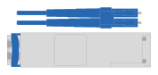

= 准备安装- E2860、E5760和DE460
:allow-uri-read: 
:icons: font
:imagesdir: ../media/

[role="lead"]
了解如何准备安装 E2860 ， E5760 或 DE460 系列存储系统。

.步骤
. 在中创建帐户并注册硬件 http://mysupport.netapp.com/["NetApp 支持"^]。
. 确保收到的包装盒中包含以下物品。
+
|===

 a| 
image:../media/trafford_overview.png["已安装驱动器和挡板的磁盘架"]
 a| 
磁盘架，挡板和机架硬件

 a| 
image:../media/handles_counted.png["磁盘架手柄"]
 a| 
磁盘架可处理 4 个磁盘架

|===
+
The following table identifies the types of cables you might receive.如果您收到的缆线未在表中列出，请参见 https://hwu.netapp.com/["Hardware Universe"^] 以找到缆线并确定其用途。

+
|===
| Connector type | 缆线类型 | 使用 ... 

 a| 
image:../media/cable_ethernet_inst-hw-e2800-e5700.png["以太网缆线"]
 a| 
以太网缆线

（如果已订购）
 a| 
管理连接

 a| 

 a| 
I/O 缆线

（如果已订购）
 a| 
为数据主机布线

 a| 
image:../media/cable_power_inst-hw-e2800-e5700.png["Power cables"]
 a| 
Power cables

每个磁盘架 2 个

（如果已订购）
 a| 
启动存储系统

 a| 
image:../media/sas_cable.png["SAS 缆线"]
 a| 
SAS 缆线（仅随驱动器架提供）
 a| 
为磁盘架布线

|===
. 请确保提供以下各项。
+
|===

 a| 
image:../media/screwdriver_inst-hw-e2800-e5700.png["Phillips #2 screwdriver"]
 a| 
Phillips #2 screwdriver

 a| 
image:../media/flashlight_inst-hw-e2800-e5700.png["Flashlight"]
 a| 
Flashlight

 a| 
image:../media/wrist_strap_inst-hw-e2800-e5700.png["ESD 腕带"]
 a| 
ESD 腕带

 a| 
image:../media/4u_dummy.png["4U机架\""]
 a| 
4U 机架空间：标准 19 英寸（ 48.30 厘米）机架，用于安装以下尺寸的 4U 磁盘架。

* 深度 * ： 38.25 英寸（ 97.16 厘米）

* 宽度 * ： 17.66 英寸（ 44.86 厘米）

* 高度 * ： 6.87 英寸（ 17.46 厘米）

* 最大重量 * ： 113 千克（ 250 磅）

 a| 
image:../media/management_station_inst-hw-e2800-e5700_g60b3.png["管理工作站、支持使用浏览器安装管理软件"]
 a| 
管理软件支持的浏览器：

** Google Chrome (89及更高版本)
** Microsoft Edge (90及更高版本)
** Mozilla Firefox (80及更高版本)
** Safari (版本14及更高版本)

|===

