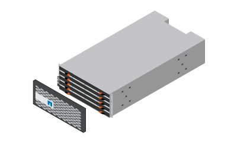

= 准备安装
:allow-uri-read: 
:icons: font
:imagesdir: ../media/

[role="lead"]
您必须对站点进行准备、以满足E4000系列存储系统的规格要求。

.步骤
. 在中创建帐户并注册硬件 http://mysupport.netapp.com/["NetApp 支持"^]。
. 确保您收到的包装盒中有以下物品：
+
[role="tabbed-block"]
====
.E4012
--
安装了驱动器的磁盘架（挡板单独包装）::
+
--

--
机架式硬件::
+
--
image:../media/superrails_inst-hw-e2800-e5700.png["机架式硬件"]

--
用于管理连接的以太网缆线(如果订购)::
+
--
image:../media/cable_ethernet_inst-hw-e2800-e5700.png["用于管理连接的以太网缆线"]

--
用于为数据主机布线的I/O缆线::
+
--
image:../media/cable_io_inst-hw-e2800-e5700.png["用于为数据主机布线的I/O缆线"]

--
Power cables::
+
--
image:../media/cable_power_inst-hw-e2800-e5700.png["Power cables"]

--
SAS 缆线::
+
--
image:../media/sas_cable.png["SAS 缆线"]

--

--
.E4060
--
磁盘架，挡板和机架硬件::
+
--

--
四个磁盘架手柄x4:: image:../media/handles_counted.png["四个磁盘架手柄"]
用于管理连接的以太网缆线(如果订购)::
+
--
image:../media/cable_ethernet_inst-hw-e2800-e5700.png["用于管理连接的以太网缆线"]

--
用于为数据主机布线的I/O缆线::
+
--
image:../media/cable_io_inst-hw-e2800-e5700.png["用于为数据主机布线的I/O缆线"]

--
Power cables::
+
--
image:../media/cable_power_inst-hw-e2800-e5700.png["Power cables"]

--
SAS 缆线::
+
--
image:../media/sas_cable.png["SAS 缆线"]

--

--
====
. 获取安装所需的其他项目：
+
** 2号飞利浦螺丝刀
** 一个使用的是一个
** ESD腕带
** 机柜或机架可容纳以下尺寸的磁盘架：
+
[role="tabbed-block"]
====
.E4012
--
*深度*：53.59厘米(21.1英寸)

*宽度*：17.64英寸(44.8)

*高度*：8.64厘米(3.4英寸)

*最大重量*：29.6千克(65.25磅)

--
.E4060
--
*深度*：92.2厘米(36.3英寸)

*宽度*：44.8厘米(17.64英寸)

*高度*：17.78厘米(7.0英寸)

*最大重量*：254.91千克(253.33磅)

--
====
** 提供正确交流电源电压的位置：
+
*** E4012：120至240伏交流电
*** E4060：240伏交流电

** 管理软件支持的浏览器：
+
*** Google Chrome (89及更高版本)
*** Microsoft Edge (90及更高版本)
*** Mozilla Firefox (80及更高版本)
*** Safari (版本14及更高版本)

