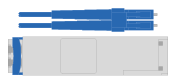

= 准备安装- EF300、EF600、EF300C和EF600C
:allow-uri-read: 
:icons: font
:imagesdir: ../media/

[role="lead"]
了解如何准备安装EF300、EF600、EF300C或EF600C系列存储系统。

.开始之前
如果要为 EF300 布线以进行 SAS 扩展，请查看以下信息：

* link:../maintenance-ef600/sas-add-supertask-task.html["添加 SAS 扩展卡"^] 用于安装 SAS 扩展卡。
* link:../install-hw-cabling/index.html["布线概述"] 用于 SAS 扩展布线。

.步骤
. 在中创建帐户并注册硬件 http://mysupport.netapp.com/["NetApp 支持"^]。
. 确保收到的包装盒中包含以下物品。
+
|===

 a| 
image:../media/ef600_w_faceplate.png["已安装驱动器和挡板的磁盘架"]
 a| 
已安装驱动器的磁盘架（挡板和端盖单独包装）

 a| 
image:../media/superrails_inst-hw-ef600.png["机架式硬件"]
 a| 
机架式硬件

|===
+
The following table identifies the types of cables you might receive.如果您收到的缆线未在表中列出，请参见 https://hwu.netapp.com/["Hardware Universe"] 以找到缆线并确定其用途。

+
|===
| Connector type | 缆线类型 | 使用 ... 

 a| 
image:../media/cable_ethernet_inst-hw-ef600.png["RJ-45以太网电缆"]
 a| 
RJ-45 以太网缆线（如果已订购）
 a| 
管理连接

 a| 

 a| 
I/O 缆线（如果已订购）
 a| 
为数据主机布线

 a| 
image:../media/cable_power_inst-hw-ef600.png["Power cables"]
 a| 
电源线（如果订购）
 a| 
启动存储系统

|===
. 请确保提供以下各项。
+
|===

 a| 
image:../media/screwdriver_inst-hw-ef600.png["Phillips #2 screwdriver"]
 a| 
Phillips #2 screwdriver

 a| 
image:../media/flashlight_inst-hw-ef600.png["Flashlight"]
 a| 
Flashlight

 a| 
image:../media/wrist_strap_inst-hw-ef600.png["ESD 腕带"]
 a| 
ESD 腕带

 a| 
image:../media/2u_rackspace_inst-hw-ef600.png["2U机架"]
 a| 
2U 机架空间：标准 19 英寸（ 48.30 厘米）机架，用于安装以下尺寸的 2U 磁盘架。

* 深度 * ： 19.0 英寸（ 48.3 厘米）

* 宽度 * ： 17.6 英寸（ 44.7 厘米）

* 高度 * ： 3.34 英寸（ 8.48 厘米）

* 磁盘架 * ： 24 个驱动器

* 最大重量 * ： 27.4 千克（ 60.5 磅）

NOTE: 使用第三方机柜可能会对电源线进行发生原因，以限制对控制器的访问。

 a| 
image:../media/management_station_inst-hw-ef600_g60b3.png["管理工作站、支持使用浏览器安装管理软件"]
 a| 
管理软件支持的浏览器：

** Google Chrome (89及更高版本)
** Microsoft Edge (90及更高版本)
** Mozilla Firefox (80及更高版本)
** Safari (版本14及更高版本)

|===

