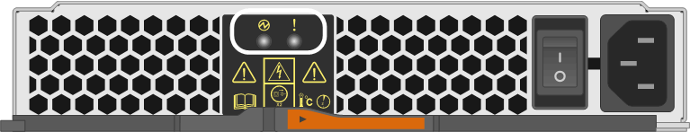

= 更换 E2800 电源（ 12 驱动器或 24 驱动器）
:allow-uri-read: 
:experimental: 
:icons: font
:imagesdir: ../media/

[role="lead"]
您可以将 E2800 阵列中的电源更换为 12 个驱动器或 24 个驱动器的磁盘架，其中包括以下磁盘架类型：

* E2812 控制器架
* E2824 控制器架
* EF280 闪存阵列
* DE212C 驱动器架
* DE224C 驱动器架

.关于此任务
每个 12 驱动器或 24 驱动器控制器架或驱动器架都包含两个带集成风扇的电源。在 SANtricity 系统管理器中，这些组件称为 _power-fan c箱 _ 。如果电源风扇箱发生故障，您必须尽快更换它，以确保磁盘架具有冗余电源和足够的散热。

您可以在存储阵列启动并执行主机 I/O 操作时更换电源， 只要磁盘架中的第二个电源处于最佳状态，并且 SANtricity System Manager 中 Recovery Guru 的详细信息区域中的 * 确定删除 * 字段显示 * 是 * 。

.开始之前
* 查看中的电源要求 link:canisters-overview-supertask-concept.html["更换箱的要求"]。
* 查看 Recovery Guru 中的详细信息，确认电源有问题描述。从 Recovery Guru 中选择 * 重新检查 * ，以确保不需要先解决任何其他问题。
* 检查电源上的琥珀色警示 LED 是否亮起，表示电源或其集成风扇出现故障。如果磁盘架中的两个电源的琥珀色警示 LED 均亮起，请联系技术支持以获得帮助。
* 确保您已具备以下条件：
+
** 您的控制器架或驱动器架型号支持的替代电源。
** ESD 腕带，或者您已采取其他防静电预防措施。

== 第 1 步：准备更换电源

准备更换 12 驱动器或 24 驱动器控制器架或驱动器架中的电源。

.步骤
. 使用 SANtricity 系统管理器收集存储阵列的支持数据。
+
.. 选择菜单： Support[ 支持中心 > 诊断 ] 。
.. 选择 * 收集支持数据 * 。
.. 单击 * 收集 * 。
+
此文件将保存在浏览器的 "Downloads" 文件夹中，名为 * support-data.7z* 。

. 在 SANtricity 系统管理器中，确定哪个电源出现故障。
+
您可以在 Recovery Guru 的 Details 区域中找到此信息，也可以查看为磁盘架显示的信息。

+
.. 选择 * 硬件 * 。
.. 查看*Shelf*下拉列表右侧的电源image:../media/sam1130_ss_hardware_power_icon_maint-e2800.gif["电源图标"]和风扇image:../media/sam1130_ss_hardware_fan_icon_maint-e2800.gif["'风扇图标\""]图标，确定哪个磁盘架的电源出现故障。
+
如果组件出现故障，其中一个或两个图标将显示为红色。

.. 找到带有红色图标的磁盘架后，选择 * 显示磁盘架的背面 * 。
.. 选择任一电源。
.. 在 * 电源 * 和 * 风扇 * 选项卡上，查看电源风扇箱，电源和风扇的状态，以确定必须更换的电源。
+
必须更换状态为 * 失败 * 的组件。

+

CAUTION: 如果磁盘架中的第二个电源箱没有 * 最佳 * 状态，请勿尝试热插拔出现故障的电源。请联系技术支持以获得帮助。

. 从存储阵列的背面，查看警示 LED 以找到需要卸下的电源。
+
您必须更换警示 LED 亮起的电源。

+

+
** 电源 LED ：如果呈 * 稳定绿色 * ，则表示电源运行正常。如果为 * 关 * ，则表示电源出现故障，交流电源开关已关闭，交流电源线安装不正确或交流电源线输入电压不在边界内（交流电源线源端存在问题）。
** 警示 LED ：如果呈 * 稳定琥珀色 * ，则表示电源或其集成风扇出现故障。

== 第 2 步：卸下故障电源

卸下故障电源，以便更换为新的电源。

.步骤
. 拆开新电源的包装，将其放在驱动器架附近的水平表面上。
+
Save all packing materials for use when returning the failed power supply.

. Turn off the power supply and disconnect the power cables:
+
.. 关闭磁盘架上的电源开关。
.. 打开电源线固定器，然后从电源拔下电源线。
.. 从电源设备拔下电源线。

. Squeeze the latch on the power supply cam handle, and then open the cam handle to fully release the power supply from the mid plane.
+
image::../media/drw_2600_psu_maint-e2800.gif[拉动凸轮把手以从中间板释放电源]

. Use the cam handle to slide the power supply out of the system.
+

CAUTION: When removing a power supply, always use two hands to support its weight.

+
卸下电源时，风门会摆动到位，以阻止空托架，从而有助于保持气流和散热。

== 第 3 步：安装新的电源

安装新电源以更换故障电源。

.步骤
. 确保新电源的开关位于 * 关闭 * 位置。
. Using both hands, support and align the edges of the power supply with the opening in the system chassis, and then gently push the power supply into the chassis using the cam handle.
+
The power supplies are keyed and can only be installed one way.

+

CAUTION: 将电源滑入系统时，请勿用力过大；否则可能会损坏连接器。

. Close the cam handle so that the latch clicks into the locked position and the power supply is fully seated.
. Reconnect the power supply cabling:
+
.. 将电源线重新连接到电源和电源。
.. 使用电源线固定器将电源线固定到电源。

. 打开新电源箱的电源。

== 第 4 步：完成电源更换

确认新电源正常工作，收集支持数据并恢复正常运行。

.步骤
. 在新电源上，检查绿色电源 LED 是否亮起，琥珀色警示 LED 是否熄灭。
. 在 SANtricity 系统管理器的恢复 Guru 中，选择 * 重新检查 * 以确保问题已解决。
. 如果仍报告出现故障的电源，请重复中的步骤 <<第 2 步：卸下故障电源>>和中的 <<第 3 步：安装新的电源>>。如果问题仍然存在，请联系技术支持。
. 删除防静电保护。
. 使用 SANtricity 系统管理器收集存储阵列的支持数据。
+
.. 选择菜单： Support[ 支持中心 > 诊断 ] 。
.. 选择 * 收集支持数据 * 。
.. 单击 * 收集 * 。
+
此文件将保存在浏览器的 "Downloads" 文件夹中，名为 * support-data.7z* 。

. 按照套件随附的 RMA 说明将故障部件退回 NetApp 。

.下一步是什么？
电源更换已完成。您可以恢复正常操作。
