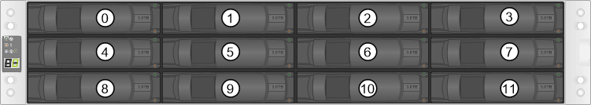

= 更换驱动器的要求- E2800
:allow-uri-read: 
:icons: font
:imagesdir: ../media/

[role="lead"]
在更换 E2800 驱动器之前，请查看要求和注意事项。

== 磁盘架类型

您可以更换 12 驱动器， 24 驱动器或 60 驱动器控制器架或驱动器架中的驱动器。

=== 12 驱动器或 24 驱动器磁盘架

图中显示了驱动器在每种类型的磁盘架中的编号方式（已卸下磁盘架的前挡板或端盖）。

* E2812 控制器架或 DE212C 驱动器架中的驱动器编号： *

* E2824 控制器架， EF280 闪存阵列或 DE224C 驱动器架中的驱动器编号： *

image::../media/28_dwg_e2824_de224c_drive_numbering_maint-e2800.gif[包含24个驱动器的磁盘架的驱动器编号]

NOTE: E2812 ， E2824 ， EF280 存储阵列可能包含一个或多个 SAS-2 原有扩展驱动器托盘，包括 DE1600 12 驱动器托盘， DE5600 24 驱动器托盘或 DE6600 60 驱动器托盘有关更换其中一个驱动器托盘中的驱动器的说明，请参见 link:https://library.netapp.com/ecm/ecm_download_file/ECMLP2577975["更换 E2660 ， E2760 ， E5460 ， E5560 或 E5660 托盘中的驱动器"^] 和 link:https://library.netapp.com/ecm/ecm_download_file/ECMLP2577971["更换 E2600 ， E2700 ， E5400 ， E5500 和 E5600 12 驱动器或 24 驱动器托盘中的驱动器"^]。

=== 60 个驱动器架

E2860 控制器架和 DE460C 驱动器架都包含五个驱动器抽盒，每个抽盒包含 12 个驱动器插槽。驱动器抽盒 1 位于顶部，驱动器抽盒 5 位于底部。

image::../media/28_dwg_e2860_de460c_front_no_callouts_maint-e2800.gif[60个驱动器抽盒"]

对于 E2860 控制器架抽屉和 DE460C 驱动器架抽屉，驱动器在磁盘架内的每个驱动器抽屉中的编号均为 0 到 11 。

image::../media/dwg_trafford_drawer_with_hdds_callouts_maint-e2800.gif[驱动器插槽编号]

NOTE: E2860 存储阵列可能包含一个或多个 SAS-2 原有扩展驱动器托盘，包括 DE1600 12 驱动器托盘， DE5600 24 驱动器托盘或 DE6600 60 驱动器托盘有关更换其中一个驱动器托盘中的驱动器的说明，请参见 link:https://library.netapp.com/ecm/ecm_download_file/ECMLP2577975["更换 E2660 ， E2760 ， E5460 ， E5560 或 E5660 托盘中的驱动器"^] 和 link:https://library.netapp.com/ecm/ecm_download_file/ECMLP2577971["更换 E2600 ， E2700 ， E5400 ， E5500 和 E5600 12 驱动器或 24 驱动器托盘中的驱动器"^]。

=== Drive drawer

您可以更换 E2860 控制器架和 DE460C 驱动器架中的驱动器抽盒。Each of these 60-drive shelves has five drive drawers.

image::../media/28_dwg_e2860_de460c_front_no_callouts_maint-e2800.gif[60个驱动器抽盒"]

五个抽盒中的每个抽盒最多可容纳 12 个驱动器。

image:../media/92_dwg_de6600_drawer_with_hdds_no_callouts_maint-e2800.gif["安装了驱动器的抽盒"]

== 驱动器处理

存储阵列中的驱动器很脆弱。驱动器处理不当是驱动器故障的主要发生原因。

请遵循以下规则以避免损坏存储阵列中的驱动器：

* 防止静电释放（ ESD ）：
+
** 请将驱动器放在 ESD 袋中，直到准备好安装为止。
** 请勿将金属工具或刀片插入 ESD 袋中。
+
用手打开 ESD 袋或用剪刀剪掉顶部。

** 请保留 ESD 袋和任何包装材料，以备日后必须退回驱动器时使用。
** 请始终佩戴 ESD 腕带，该腕带接地至机箱上未上漆的表面。
+
如果没有腕带，请先触摸存储机箱机箱上未上漆的表面，然后再处理驱动器。

* 小心处理驱动器：
+
** 在拆卸，安装或搬运驱动器时，请始终用双手。
** 切勿将驱动器强行插入磁盘架，并用力轻推驱动器闩锁，使其完全啮合。
** 将驱动器放置在缓冲表面上，切勿将驱动器堆叠在彼此之上。
** 请勿将驱动器撞到其他表面。
** 从磁盘架中取出驱动器之前，请解锁把手并等待 60 秒，使驱动器停止旋转。
** 运输驱动器时，请始终使用经过批准的包装。

* 避免磁场：
+
** 使驱动器远离磁性设备。
+
磁场可能会破坏驱动器上的所有数据，并且发生原因会对驱动器电路造成不可修复的损坏。

