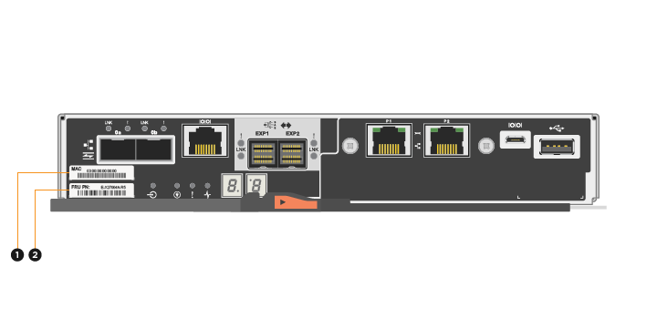
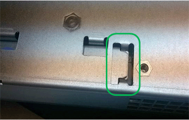

= 更换双工配置中的控制器
:allow-uri-read: 
:experimental: 
:icons: font
:imagesdir: ../media/

[role="lead"]
您可以在双工（双控制器）配置中更换以下控制器架的控制器箱：

* E5724 控制器架
* E5760 控制器架

.关于此任务
每个控制器箱都包含一个控制器卡，一个电池和一个可选的主机接口卡（ HIC ）。更换控制器箱时，您必须从原始控制器箱中取出电池和 HIC （如果已安装），然后将其安装到替代控制器箱中。

NOTE: 此任务仅适用于具有两个控制器的存储阵列（双工配置）。

.您需要的内容
* 与要更换的控制器箱部件号相同的替代控制器箱。（请参见步骤 1 以验证部件号。）
* ESD 腕带，或者您已采取其他防静电预防措施。
* 1 号十字螺丝刀。
* 用于标识连接到控制器箱的每个缆线的标签。
* 一个管理工作站，其浏览器可访问控制器的 SANtricity 系统管理器。（要打开 System Manager 界面，请将浏览器指向控制器的域名或 IP 地址。）

== 第 1 步：准备更换控制器（双工）

通过验证更换用的控制器箱是否具有正确的 FRU 部件号，备份配置并收集支持数据，准备更换控制器箱。如果控制器仍处于联机状态，则必须使其脱机。

.步骤
. 拆开新控制器箱的包装，将其放在无静电的平面上。
+
请保存包装材料，以便在运输故障控制器箱时使用。

+

NOTE: 替代控制器预安装了 16 GB 内存。如果您的控制器需要 64 GB 配置，请在安装替代控制器之前使用随附的升级套件。

. 找到控制器箱背面的 MAC 地址和 FRU 部件号标签。
+

+
* （ 1 ） * _MAC 地址： _ 管理端口 1 的 MAC 地址（ "`P1` " ）。如果使用 DHCP 获取原始控制器的 IP 地址，则需要使用此地址连接到新控制器。

+
* （ 2 ） * _FRU 部件号： _ 此编号必须与当前安装的控制器的更换部件号匹配。

. 在 SANtricity 系统管理器中，找到要更换的控制器箱的更换部件号。
+
如果控制器出现故障并需要更换，则更换部件号将显示在 Recovery Guru 的 Details 区域中。如果您需要手动查找此编号，请按照以下步骤操作：

+
.. 选择 * 硬件 * 。
.. 找到标记有控制器图标的控制器架 image:../media/sam1130_ss_hardware_controller_icon_maint-e5700.gif[""]。
.. 单击控制器图标。
.. 选择控制器，然后单击 * 下一步 * 。
.. 在 * 基本 * 选项卡上，记下控制器的 * 更换部件号 * 。

. 确认故障控制器的更换部件号与更换控制器的 FRU 部件号相同。
+

CAUTION: * 可能会丢失数据访问 * - 如果两个部件号不同，请勿尝试使用此操作步骤。此外，如果发生故障的控制器箱包含主机接口卡（ HIC ），则必须将该 HIC 安装到新的控制器箱中。如果存在不匹配的控制器或 HIC ，则会导致新控制器在联机时锁定。

. 使用 SANtricity 系统管理器备份存储阵列的配置数据库。
+
如果删除控制器时出现问题，您可以使用保存的文件还原配置。系统将保存 RAID 配置数据库的当前状态，其中包括控制器上卷组和磁盘池的所有数据。

+
** 在 System Manager 中：
+
... 选择菜单： Support[ 支持中心 > 诊断 ] 。
... 选择 * 收集配置数据 * 。
... 单击 * 收集 * 。
+
此文件将保存在浏览器的 "Downloads" 文件夹中，名为 * configurationData-<arrayName>-<DateTime>.7z* 。

** 或者，您也可以使用以下命令行界面命令备份配置数据库：
+
`s存取存储阵列 dbmDatabase sourceLocation=Onboard contentType=all file="filename" ；`

. 使用 SANtricity 系统管理器收集存储阵列的支持数据。
+
如果删除控制器时出现问题，您可以使用保存的文件对问题描述进行故障排除。系统会将有关存储阵列的清单，状态和性能数据保存在一个文件中。

+
.. 选择菜单： Support[ 支持中心 > 诊断 ] 。
.. 选择 * 收集支持数据 * 。
.. 单击 * 收集 * 。
+
此文件将保存在浏览器的 "Downloads" 文件夹中，名为 * support-data.7z* 。

. 如果控制器尚未脱机，请立即使用 SANtricity 系统管理器将其脱机。
+
** 在 SANtricity 系统管理器中：
+
... 选择 * 硬件 * 。
... 如果图形显示了驱动器，请选择 * 显示磁盘架背面 * 以显示控制器。
... 选择要置于脱机状态的控制器。
... 从上下文菜单中，选择 * 置于脱机状态 * ，然后确认要执行此操作。
+

NOTE: 如果您正在使用尝试脱机的控制器访问 SANtricity 系统管理器，则会显示 SANtricity 系统管理器不可用消息。选择 * 连接到备用网络连接 * 以使用另一个控制器自动访问 SANtricity 系统管理器。

** 或者，您也可以使用以下命令行界面命令使控制器脱机：
+
* 对于控制器 A ： * `set controller [a] availability = 脱机`

+
* 对于控制器 B ： * `set controller [b] availability = 脱机`

. 等待 SANtricity System Manager 将控制器状态更新为脱机。
+

CAUTION: 更新状态之前，请勿开始任何其他操作。

. 从 Recovery Guru 中选择 * 重新检查 * ，然后确认详细信息区域中的 * 确定删除 * 字段显示 * 是 * ，表示可以安全删除此组件。

== 第 2 步：卸下控制器箱（双工）

拆下一个控制器箱，将故障箱更换为一个新的控制器箱。

.步骤
. 戴上 ESD 腕带或采取其他防静电预防措施。
. 为连接到控制器箱的每个缆线贴上标签。
. 断开控制器箱的所有缆线。
+

CAUTION: To prevent degraded performance, do not twist, fold, pinch, or step on the cables.

. 如果控制器箱中的 HIC 使用 SFP+ 收发器，请卸下 SFP 。
+
由于必须从故障控制器箱中卸下 HIC ，因此必须从 HIC 端口中卸下所有 SFP 。但是，您可以保留在基板主机端口中安装的任何 SFP 。重新连接缆线后，您可以将这些 SFP 移至新控制器箱。

. 确认控制器背面的缓存活动 LED 是否熄灭。
. 按压凸轮把手上的闩锁，直到其释放为止，然后打开右侧的凸轮把手，以从磁盘架中释放控制器箱。
+
下图是 E5724 控制器架的示例：

+
image::../media/28_dwg_e2824_remove_controller_canister_maint-e5700.gif[28 dwg e2824 卸下控制器箱 maint e5700]

+
* （ 1 ） * _ 控制器箱 _

+
* （ 2 ） * _Cam handle

+
下图是 E5760 控制器架的示例：

+
image::../media/28_dwg_e2860_add_controller_canister_maint-e5700.gif[28 dwg e2860 添加控制器箱维护 e5700]

+
* （ 1 ） * _ 控制器箱 _

+
* （ 2 ） * _Cam handle

. 用两只手和凸轮把手将控制器箱滑出磁盘架。
+

CAUTION: 始终用双手支撑控制器箱的重量。

+
如果要从 E5724 控制器架中卸下控制器箱，则一个翼片会摆入到位以阻止空托架，从而有助于保持气流和散热。

. 将控制器箱翻转，使可拆卸盖朝上。
. 将控制器箱放在无静电的平面上。

== 第 3 步：取出电池（双工）

取出电池，以便安装新控制器。

.步骤
. 向下按按钮并滑动控制器箱盖，即可取下控制器箱盖。
. 确认控制器（电池和 DIMM 之间）中的绿色 LED 熄灭。
+
如果此绿色 LED 亮起，则表示控制器仍在使用电池电源。您必须等待此 LED 熄灭，然后才能卸下任何组件。

+
image::../media/28_dwg_e2800_internal_cache_active_led_maint-e5700.gif[28 dwg e2800 内部缓存活动 LED maint e5700]

+
* （ 1 ） * _Internal Cache Active LED_

+
* （ 2 ） * 电池 _

. 找到电池的蓝色释放闩锁。
. 向下推动释放闩锁并将其从控制器箱中移出，以解锁电池。
+
image::../media/28_dwg_e2800_remove_battery_maint-e5700.gif[28 dwg e2800 取出电池维护 e5700]

+
* （ 1 ） * 电池释放闩锁 _

+
* （ 2 ） * 电池 _

. 抬起电池，将其滑出控制器箱。

== 第 4 步：卸下主机接口卡（双工）

如果控制器箱包含主机接口卡（ HIC ），请从原始控制器箱中取出 HIC ，以便可以在新控制器箱中重复使用。

.步骤
. 使用 1 号十字螺丝刀卸下将 HIC 面板连接到控制器箱的螺钉。
+
有四个螺钉：一个在顶部，一个在侧面，两个在正面。

+
image::../media/28_dwg_e2800_hic_faceplace_screws_maint-e5700.gif[28 dwg e2800 hic faceplace 螺丝 maint e5700]

. 卸下 HIC 面板。
. 使用您的手指或十字螺丝刀松开将 HIC 固定到控制器卡的三个翼形螺钉。
. 小心地将 HIC 从控制器卡上卸下，方法是将该卡抬起并滑回。
+

NOTE: 请注意，不要擦除或撞击 HIC 底部或控制器卡顶部的组件。

+
image::../media/28_dwg_e2800_hic_thumbscrews_maint-e5700.gif[28 个 dwg e2800 hic 翼形螺钉 maint e5700]

+
* （ 1 ） * _ 主机接口卡（ HIC ） _

+
* （ 2 ） * _ 翼形螺钉 _

. 将 HIC 放置在无静电表面上。

== 第 5 步：安装电池（双工）

将电池安装到更换用的控制器箱中。您可以安装从原始控制器箱中取出的电池，也可以安装您订购的新电池。

.步骤
. 将替代控制器箱翻转，使可拆卸盖朝上。
. 向下按压盖板按钮，然后将盖板滑出。
. 调整控制器箱的方向，使电池插槽面向您。
. 将电池略微向下插入控制器箱。
+
您必须将电池前部的金属法兰插入控制器箱底部的插槽中，然后将电池顶部滑入控制器箱左侧的小对齐销下。

. 向上移动电池闩锁以固定电池。
+
当闩锁卡入到位时，闩锁的底部会挂到机箱上的金属插槽中。

+
image::../media/28_dwg_e2800_insert_battery_maint-e5700.gif[28 dwg e2800 插入电池维护 e5700]

+
* （ 1 ） * 电池释放闩锁 _

+
* （ 2 ） * 电池 _

. 将控制器箱翻转，以确认电池安装正确。
+

CAUTION: * 可能的硬件损坏 * —电池前部的金属法兰必须完全插入控制器箱上的插槽（如第一图所示）。如果电池安装不正确（如图 2 所示），则金属法兰可能会接触控制器板，从而在您接通电源时损坏控制器。

+
** * 正确 * —电池的金属法兰已完全插入控制器上的插槽：
+

** * 不正确 * —电池的金属法兰未插入控制器上的插槽：
+
image:../media/28_dwg_e2800_battery_flange_not_ok_maint-e5700.gif[""]

== 第 6 步：安装主机接口卡（双工）

如果从原始控制器箱中取出了 HIC ，则必须将该 HIC 安装到新控制器箱中。

.步骤
. 使用 1 号十字螺丝刀，卸下将空白面板连接到更换用控制器箱的四个螺钉，然后卸下面板。
. 将 HIC 上的三个翼形螺钉与控制器上的相应孔对齐，并将 HIC 底部的连接器与控制器卡上的 HIC 接口连接器对齐。
+
请注意，不要擦除或撞击 HIC 底部或控制器卡顶部的组件。

. 小心地将 HIC 放低到位，然后轻按 HIC 以固定 HIC 连接器。
+

CAUTION: * 可能的设备损坏 * —请务必小心，不要挤压 HIC 和翼形螺钉之间控制器 LED 的金带连接器。

+
image::../media/28_dwg_e2800_hic_thumbscrews_maint-e5700.gif[28 个 dwg e2800 hic 翼形螺钉 maint e5700]

+
* （ 1 ） * _ 主机接口卡（ HIC ） _

+
* （ 2 ） * _ 翼形螺钉 _

. 手动拧紧 HIC 翼形螺钉。
+
请勿使用螺丝刀，否则可能会过度拧紧螺钉。

. 使用 1 号十字螺丝刀，使用四个螺钉将从原始控制器箱中卸下的 HIC 面板连接到新控制器箱。
+
image::../media/28_dwg_e2800_hic_faceplace_screws_maint-e5700.gif[28 dwg e2800 hic faceplace 螺丝 maint e5700]

== 第 7 步：安装新的控制器箱（双工）

安装电池和主机接口卡（ HIC ）后，如果最初安装了一个，则可以将新的控制器箱安装到控制器架中。

.步骤
. 将控制器箱盖从背面向前滑动，直到按钮卡入到位，从而重新安装控制器箱上的盖。
. 将控制器箱翻转，使可拆卸盖朝下。
. 在凸轮把手处于打开位置的情况下，将控制器箱完全滑入控制器架。
+
image::../media/28_dwg_e2824_remove_controller_canister_maint-e5700.gif[28 dwg e2824 卸下控制器箱 maint e5700]

+
* （ 1 ） * _ 控制器箱 _

+
* （ 2 ） * _Cam handle

+
image::../media/28_dwg_e2860_add_controller_canister_maint-e5700.gif[28 dwg e2860 添加控制器箱维护 e5700]

+
* （ 1 ） * _ 控制器箱 _

+
* （ 2 ） * _Cam handle

. 将凸轮把手移至左侧，将控制器箱锁定到位。
. 在新控制器的主机端口中安装原始控制器中的 SFP ，然后重新连接所有缆线。
+
如果使用多个主机协议，请确保将 SFP 安装在正确的主机端口中。

. 如果原始控制器使用 DHCP 作为 IP 地址，请在替代控制器背面的标签上找到 MAC 地址。请您的网络管理员将您删除的控制器的 DNS/network 和 IP 地址与替代控制器的 MAC 地址相关联。
+

NOTE: 如果原始控制器未使用 DHCP 作为 IP 地址，则新控制器将采用您删除的控制器的 IP 地址。

== 第 8 步：完成控制器更换（双工）

将控制器置于联机状态，收集支持数据并恢复操作。

.步骤
. 在控制器启动时，检查控制器 LED 和七段显示器。
+
重新建立与另一控制器的通信时：

+
** 七段显示将重复显示 * 操作系统 * ， * 其他 * ， * 空白 _* 序列，以指示控制器已脱机。
** 琥珀色警示 LED 仍保持亮起状态。
** 主机链路 LED 可能亮起，闪烁或熄灭，具体取决于主机接口。image:../media/e5700_hic_3_callouts_maint-e5700.gif[""]
+
* （ 1 ） * _Host Link LED_

+
* （ 2 ） * _ 警示 LED （琥珀色） _

+
* （ 3 ） * _seven-segment display_

. 在控制器的七段显示器恢复联机时，请检查其上的代码。如果显示屏显示以下重复序列之一，请立即卸下控制器。
+
** * 操作系统 * ， * 操作系统 0* ， * 空白 _* （控制器不匹配）
** * 操作系统 * ， * 第 6 层 * ， * 空白 _* （不受支持的 HIC ）
+

CAUTION: * 可能会丢失数据访问 * - 如果您刚刚安装的控制器显示一个此类代码，而另一个控制器因任何原因被重置，则第二个控制器也可能会锁定。

. 控制器恢复联机后，确认其状态为最佳，并检查控制器架的警示 LED 。
+
如果状态不是最佳状态，或者任何警示 LED 均亮起，请确认所有缆线均已正确就位，并且控制器箱已正确安装。如有必要，请拆下并重新安装控制器箱。

+

NOTE: 如果无法解决此问题，请联系技术支持。

. 如果需要，请将所有卷重新分配给其首选所有者。
+
.. 选择菜单： Storage[Volumes] 。
.. 选择菜单：更多 [ 重新分配卷 ] 。

. 单击菜单： Hardware[ 支持 > 升级中心 ] 以确保已安装最新版本的 SANtricity OS 软件（控制器固件）。
+
根据需要安装最新版本。

. 如果需要，请使用 SANtricity 系统管理器收集存储阵列的支持数据。
+
.. 选择菜单： Support[ 支持中心 > 诊断 ] 。
.. 选择 * 收集支持数据 * 。
.. 单击 * 收集 * 。
+
此文件将保存在浏览器的 "Downloads" 文件夹中，名为 * support-data.7z* 。

.下一步是什么？
控制器更换已完成。您可以恢复正常操作。
