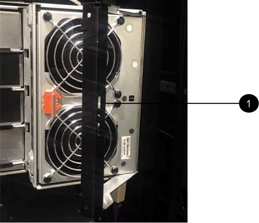

= 更换 E5700 驱动器抽屉（ 60 个驱动器）
:allow-uri-read: 
:experimental: 
:icons: font
:imagesdir: ../media/

[role="lead"]
您可以更换 E5700 阵列中的驱动器抽盒。

更换 E5760 控制器架或 DE460C 驱动器架中发生故障的驱动器抽盒的步骤取决于抽盒中的卷是否受抽盒丢失保护。如果驱动器抽盒中的所有卷都位于具有抽盒丢失保护的磁盘池或卷组中，则可以联机执行此操作步骤。否则，在更换驱动器抽盒之前，您必须停止所有主机 I/O 活动并关闭磁盘架电源。

.开始之前
* 查看中的驱动器处理要求 link:drives-overview-supertask-concept.html["更换 E5700 驱动器的要求"]。
* 确保驱动器架满足以下所有条件：
+
** 驱动器架不能温度过高。
** 两个风扇都必须已安装并处于最佳状态。
** 所有驱动器架组件都必须安装到位。
** 驱动器抽盒中的卷不能处于已降级状态。

CAUTION: * 可能丢失数据访问 * - 如果卷已处于 " 已降级 " 状态，并且您从驱动器抽盒中删除了驱动器，则卷可能会失败。

.您需要什么？ #8217 ；将需要什么
* NetApp 为您的控制器架或驱动器架支持的替代驱动器。
* ESD 腕带，或者您已采取其他防静电预防措施。
* 一个手电筒。
* 一个永久标记，用于在从抽盒中取出驱动器时记下每个驱动器的确切位置。
* 访问存储阵列的命令行界面（ CLI ）。如果您无法访问 CLI ，可以执行以下操作之一：
+
** * 对于 SANtricity System Manager （ 11.60 及更高版本） * —从 System Manager 下载命令行界面包（ zip 文件）。转到菜单：设置 [ 系统 > 加载项 > 命令行界面 ] 。然后，您可以从操作系统提示符处执行问题描述命令行界面命令，例如 DOS C ：提示符。
** * 对于 SANtricity 存储管理器 / 企业管理窗口（ EMW ） * —按照快速指南中的说明下载并安装该软件。您可以从 EMW 中运行命令行界面命令，方法是选择菜单： Tools[ 执行脚本 ] 。

== 第 1 步：准备更换驱动器抽盒（ 60 个驱动器）

准备更换驱动器抽盒，方法是确定是否可以在驱动器架联机时执行更换操作步骤，或者是否需要停止主机 I/O 活动并关闭任何已打开电源的磁盘架。如果要将磁盘架中的抽盒更换为抽盒丢失保护，则无需停止主机 I/O 活动并关闭任何磁盘架。

.步骤
. 确定驱动器架是否已打开电源。
+
** 如果电源已关闭，则无需对命令行界面命令执行问题描述。转至 <<Step 2: Remove cable chains>>。
** 如果已打开电源，请转至下一步。

. 在命令行中键入以下命令，然后按 * 输入 * ：
+
[listing]
----
SMcli <ctlr_IP1\> -p "array_password" -c "set tray [trayID] drawer [drawerID]
serviceAllowedIndicator=on;"
----
+
其中：

+
** ` <ctlr_ip1>` 是控制器的标识符。
** `array_password` 是存储阵列的密码。您必须将 array_password 的值用双引号括起来（ "" ）。
** `` 磁盘架 ID] 是包含要更换的驱动器抽盒的驱动器架的标识符。驱动器架 ID 值为 0 到 99 。您必须将 `纸托 ID` 的值用方括号括起来。
** `` ， rawerID] 是要更换的驱动器抽盒的标识符。抽盒 ID 值为 1 （顶部抽盒）到 5 （底部抽盒）。您必须将 `drawerID` 的值用方括号括起来。此命令可确保您可以卸下驱动器架 10 中最顶部的抽盒：

+
[listing]
----
SMcli <ctlr_IP1\> -p "safety-1" -c "set tray [10] drawer [1]
serviceAllowedIndicator=forceOnWarning;"
----
. 确定是否需要停止主机 I/O 活动，如下所示：
+
** 如果命令成功，则无需停止主机 I/O 活动。抽盒中的所有驱动器均位于具有抽盒丢失保护的池或卷组中。转至 <<Step 2: Remove cable chains>>。
+

CAUTION: * 可能对驱动器造成的损坏 * —在命令完成后等待 30 秒，然后再打开驱动器抽盒。等待 30 秒后，驱动器将发生转速下降，从而防止可能对硬件造成的损坏。

** 如果显示警告，指出此命令无法完成，则必须先停止主机 I/O 活动，然后再删除此抽盒。显示此警告的原因是，受影响抽盒中的一个或多个驱动器位于不具有抽盒丢失保护的池或卷组中。为了避免丢失数据，您必须完成以下步骤以停止主机 I/O 活动并关闭驱动器架和控制器架的电源。

. 确保存储阵列与所有已连接主机之间未发生任何 I/O 操作。例如，您可以执行以下步骤：
+
** 停止涉及从存储映射到主机的 LUN 的所有进程。
** 确保没有应用程序向从存储映射到主机的任何 LUN 写入数据。
** 卸载与阵列上的卷关联的所有文件系统。
+

NOTE: 停止主机 I/O 操作的确切步骤取决于主机操作系统和配置，这些步骤不在本说明的范围之内。如果您不确定如何停止环境中的主机 I/O 操作，请考虑关闭主机。

. 如果存储阵列参与镜像关系，请停止二级存储阵列上的所有主机 I/O 操作。
+

CAUTION: * 可能的数据丢失 * - 如果在执行 I/O 操作时继续执行此操作步骤，则主机应用程序可能会丢失数据，因为无法访问存储阵列。

. 等待缓存中的所有数据写入驱动器。
+
当需要将缓存数据写入驱动器时，每个控制器背面的绿色缓存活动 LED 亮起。您必须等待此 LED 关闭。

+
image::../media/e5700_ib_hic_w_cache_led_callouts_maint-e5700.gif[e5700 IB hic w cache led 标注 maint e5700]

+
* （ 1 ） * _Cache 活动 LED

. 从 SANtricity 系统管理器的主页页面中，选择 * 查看正在执行的操作 * 。
. 等待所有操作完成，然后再继续下一步。
. 按如下所示关闭磁盘架：
+
** 如果要更换磁盘架 * 带有 * 抽盒丢失保护 _ 中的抽盒：
+
无需关闭任何磁盘架。

+
您可以在驱动器抽盒联机时执行更换操作步骤，因为已成功完成 `SET 抽盒服务操作允许指示符` 命令行界面命令。

** 如果要更换 * 控制器 * 磁盘架 * 不带 * 抽盒丢失保护 _ 中的抽盒：
+
... 关闭控制器架上的两个电源开关。
... 等待控制器架上的所有 LED 变暗。

** 如果要更换 * 扩展 * 驱动器架 * 不带 * 抽盒丢失保护 _ 中的抽盒：
+
... 关闭控制器架上的两个电源开关。
... 等待控制器架上的所有 LED 变暗。
... 关闭驱动器架上的两个电源开关。
... 等待两分钟，使驱动器活动停止。

== 第 2 步：拆下缆线链

卸下两个缆线链，以便卸下和更换出现故障的驱动器抽盒。左右缆线链允许抽盒滑入和滑出。

Each drive drawer has left and right cable chains.缆线链上的金属端滑入机箱内相应的垂直和水平导轨，如下所示：

* 左右垂直导轨将缆线链连接到机箱的中板。
* 左右水平导轨将缆线链连接到各个抽屉。

CAUTION: * 可能的硬件损坏 * - 如果驱动器托架已打开电源，则缆线链将通电，直到两端均已拔出为止。为避免设备发生短接，如果缆线链的另一端仍插入，请勿让已拔出的缆线链连接器接触金属机箱。

.步骤
. 确保主机 I/O 活动已停止，并且驱动器架或控制器架已关闭电源，或者问题描述 the `Set Intener Attention Ind指示 器` CLI 命令。
. 从驱动器架后部，卸下右侧风扇箱：
+
.. 按下橙色卡舌以释放风扇箱手柄。
+
此图显示了从左侧橙色卡舌中伸出并释放的风扇箱手柄。

+

+
* （ 1 ） * _ 风扇箱把手 _

.. 使用把手将风扇箱从驱动器托盘中拉出，并放在一旁。
.. 如果托盘已打开电源，请确保左侧风扇达到其最大速度。
+

CAUTION: * 由于过热可能导致设备损坏 * - 如果托盘已打开电源，请勿同时卸下两个风扇。否则，设备可能会过热。

. 确定要断开的缆线链：
+
** 如果已打开电源，则抽盒正面的琥珀色警示 LED 将指示您需要断开的缆线链。
** 如果电源已关闭，您必须手动确定要断开五个缆线链中的哪一个。此图显示了已卸下风扇箱的驱动器架右侧。卸下风扇箱后，您可以看到五个缆线链以及每个抽盒的垂直和水平连接器。
+
The top cable chain is attached to drive drawer 1.The bottom cable chain is attached to drive drawer 5.The callouts for drive drawer 1 are provided.

+
image::../media/trafford_cable_rail_1_maint-e5700.gif[TRafford 缆线导轨 1 维护 e5700]

+
* （ 1 ） * _ 垂直连接器（连接到中板） _

+
* （ 2 ） * _Cable chain_

+
* （ 3 ） * _ 水平连接器（已连接到抽盒） _

. 为了便于访问，请用您的手指将右侧的缆线链移至左侧。
. 从相应的垂直导轨断开任何右侧缆线链。
+
.. 使用手电筒找到连接到机箱中垂直导轨的缆线链末端的橙色环。
+
image::../media/trafford_cable_rail_3_maint-e5700.gif[Trafford 缆线导轨 3 维护 e5700]

+
* （ 1 ） * 垂直导轨上的橙色环 _

+
* （ 2 ） * _Cable chain ， partially removed_

.. 要解锁缆线链，请将您的手指插入橙色环，然后向系统中间按压。
.. 要拔下缆线链，请小心地将您的手指拉向您大约 1 英寸（ 2.5 厘米）。将缆线链连接器保留在垂直导轨中。（如果驱动器托盘已打开电源，请勿让缆线链连接器接触金属机箱。）

. 断开缆线链的另一端：
+
.. 使用手电筒找到连接到机箱中水平导轨的缆线链末端的橙色环。
+
The figure shows the horizontal connector on the right and the cable chain disconnected and partially pulled out on the left side.

+
image::../media/trafford_cable_rail_2_maint-e5700.gif[TRafford 缆线导轨 2 维护 e5700]

+
* （ 1 ） * 水平导轨上的橙色环 _

+
* （ 2 ） * _Cable chain ， partially removed_

.. 要解锁缆线链，请将您的手指轻轻插入橙色环并向下推。
+
此图显示了水平导轨上的橙色环（请参见上图中的项目 1 ），因为它已向下推，以便将缆线链的其余部分拉出机箱。

.. Pull your finger toward you to unplug the cable chain.

. Carefully pull the entire cable chain out of the drive shelf.
. 更换右侧风扇箱：
+
.. 将风扇箱完全滑入磁盘架。
.. 移动风扇箱手柄，直到其与橙色卡舌锁定为止。
.. 如果驱动器架已通电，请确认风扇背面的琥珀色警示 LED 未亮起，并且风扇背面有空气。
+
在重新安装风扇后，当两个风扇均达到正确速度时， LED 可能会保持亮起长达一分钟。

+
如果电源已关闭，则风扇不会运行，并且 LED 未亮起。

. 从驱动器架背面，卸下左侧风扇箱。
. 如果驱动器架已通电，请确保正确的风扇达到其最大速度。
+

CAUTION: * 由于过热可能导致设备损坏 * - 如果磁盘架已打开电源，请勿同时卸下两个风扇。否则，设备可能会过热。

. 断开左侧缆线链与其垂直导轨的连接：
+
.. 使用手电筒找到连接到垂直导轨的缆线链末端的橙色环。
.. 要解锁缆线链，请将您的手指插入橙色环。
.. 要拔下缆线链，请将其拉向您大约 1 英寸（ 2.5 厘米）。将缆线链连接器保留在垂直导轨中。
+

CAUTION: * 可能的硬件损坏 * - 如果驱动器托架已打开电源，则缆线链将通电，直到两端均已拔出为止。为避免设备发生短接，如果缆线链的另一端仍插入，请勿让已拔出的缆线链连接器接触金属机箱。

. 断开左侧缆线链与水平导轨的连接，然后将整个缆线链从驱动器架中拉出。
+
如果在打开电源的情况下执行此操作步骤，则在断开最后一个缆线链连接器时，所有 LED 都会熄灭，包括琥珀色警示 LED 。

. 更换左侧风扇箱。如果驱动器架已通电，请确认风扇背面的琥珀色 LED 未亮起，并且风扇背面有空气。
+
在重新安装风扇后，当两个风扇均达到正确速度时， LED 可能会保持亮起长达一分钟。

== 第 3 步：卸下故障驱动器抽盒（ 60 个驱动器）

卸下故障驱动器抽盒，将其更换为新的驱动器抽盒。

CAUTION: * 可能丢失数据访问 * - 磁场可能会破坏驱动器上的所有数据，并且发生原因会对驱动器电路造成无法弥补的损坏。To avoid loss of data access and damage to the drives, always keep drives away from magnetic devices.

.步骤
. 请确保：
+
** 从驱动器抽盒中卸下左右缆线链。
** 更换左右风扇箱。

. Remove the bezel from the front of the drive shelf.
. Unlatch the drive drawer by pulling out on both levers.
. Using the extended levers, carefully pull the drive drawer out until it stops.Do not completely remove the drive drawer from the drive shelf.
. 如果已创建并分配卷，请使用永久标记来记下每个驱动器的确切位置。For example, using the following drawing as a reference, write the appropriate slot number on the top of each drive.
+
image::../media/dwg_trafford_drawer_with_hdds_callouts_maint-e5700.gif[带 HDD 标注的 ｛ \f219 DWG Trafford ｝ 抽盒 maint e5700]

+

CAUTION: * 可能会丢失数据访问 * —请务必在删除每个驱动器之前记录其确切位置。

. Remove the drives from the drive drawer:
+
.. Gently pull back the orange release latch that is visible on the center front of each drive.
.. Raise the drive handle to vertical.
.. Use the handle to lift the drive from the drive drawer.
+
image::../media/92_dwg_de6600_install_or_remove_drive_maint-e5700.gif[92 dwg de6600 安装或删除驱动器 maint e5700]

.. Place the drive on a flat, static-free surface and away from magnetic devices.

. 卸下驱动器抽盒：
+
.. Locate the plastic release lever on each side of the drive drawer.
+
image::../media/92_pht_de6600_drive_drawer_release_lever_maint-e5700.gif[92 PHT de6600 驱动器抽盒释放杆 maint e5700]

+
* （ 1 ） * 驱动器抽盒释放杆 _

.. 向您的方向拉动闩锁，以松开两个释放杆。
.. While holding both release levers, pull the drive drawer toward you.
.. Remove the drive drawer from the drive shelf.

== 第 4 步：安装新的驱动器抽盒（ 60 个驱动器）

安装新的驱动器抽盒以更换出现故障的驱动器抽盒。

.步骤
. 确定安装每个驱动器的位置。
. From the front of the drive shelf, shine a flashlight into the empty drawer slot, and locate the lock-out tumbler for that slot.
+
The lock-out tumbler assembly is a safety feature that prevents you from being able to open more than one drive drawer at one time.

+
image::../media/92_pht_de6600_lock_out_tumbler_detail_maint-e5700.gif[92 pht de6600 锁定了 tumbler detail maint e5700]

+
* （ 1 ） * _Lock-out tumbler_

+
* （ 2 ） * _抽 盒指南 _

. Position the replacement drive drawer in front of the empty slot and slightly to the right of center.
+
Positioning the drawer slightly to the right of center helps to ensure that the lock-out tumbler and the drawer guide are correctly engaged.

. Slide the drive drawer into the slot, and ensure that the drawer guide slides under the lock-out tumbler.
+

CAUTION: * 设备损坏风险 * —如果抽盒导轨未滑入锁定转储器下方，则会发生损坏。

. Carefully push the drive drawer all the way in until the latch fully engages.
+
首次将抽盒合上时，电阻级别较高是正常现象。

+

CAUTION: * 设备损坏风险 * —如果您感到绑定，请停止推驱动器抽盒。Use the release levers at the front of the drawer to slide the drawer back out.然后，将抽盒重新插入插槽中，确保翻转器位于导轨上方，并且导轨正确对齐。

== 第 5 步：连接缆线链

连接缆线链，以便可以安全地将驱动器重新安装到驱动器抽盒中。

When attaching a cable chain, reverse the order you used when disconnecting the cable chain.您必须先将链的水平连接器插入机箱中的水平导轨，然后再将链的垂直连接器插入机箱中的垂直导轨。

.步骤
. 请确保：
+
** 您已完成安装新驱动器抽盒的步骤。
** You have two replacement cable chains, marked as LEFT and RIGHT (on the horizontal connector next to the drive drawer).

. 从驱动器架背面，卸下右侧的风扇箱并将其放在一旁。
. 如果磁盘架已打开电源，请确保左侧风扇达到其最大速度。
+

CAUTION: * 由于过热可能导致设备损坏 * - 如果磁盘架已打开电源，请勿同时卸下两个风扇。否则，设备可能会过热。

. 连接正确的缆线链：
+
.. 找到右侧缆线链上的水平和垂直连接器以及机箱内相应的水平导轨和垂直导轨。
.. 将两个缆线链连接器与其对应的导轨对齐。
.. 将缆线链的水平连接器滑入水平导轨上，并尽可能将其推入。
+

CAUTION: * 设备故障风险 * —确保将连接器滑入导轨。If the connector rests on the top of the guide rail, problems might occur when the system runs.

+
此图显示了机箱中第二个驱动器抽盒的水平和垂直导轨。

+
image::../media/2860_dwg_both_guide_rails_maint-e5700.gif[2860 dwg 两个导轨 maint e5700]

+
* （ 1 ） * _ 水平导轨 _

+
* （ 2 ） * _ 垂直导轨 _

.. 将右侧缆线链上的垂直连接器滑入垂直导轨。
.. After you have reconnected both ends of the cable chain, carefully pull on the cable chain to verify that both connectors are latched.
+

CAUTION: 设备故障的风险 * —如果连接器未锁紧，则在抽盒操作期间，缆线链可能会松动。

. 重新安装右侧风扇箱。如果驱动器架已通电，请确认风扇背面的琥珀色 LED 现在已熄灭，并且空气现在从背面出来。
+
重新安装风扇后，如果风扇设置为正确的速度，则 LED 可能会保持亮起长达一分钟。

. 从驱动器架背面，卸下驱动器架左侧的风扇箱。
. 如果磁盘架已打开电源，请确保正确的风扇达到其最大速度。
+

CAUTION: * 由于过热可能导致设备损坏 * - 如果磁盘架已打开电源，请勿同时卸下两个风扇。否则，设备可能会过热。

. 重新连接左侧缆线链：
+
.. 找到缆线链上的水平和垂直连接器以及机箱内相应的水平和垂直导轨。
.. 将两个缆线链连接器与其对应的导轨对齐。
.. 将缆线链的水平连接器滑入水平导轨，并将其推入尽可能远的位置。
+

CAUTION: * 设备故障风险 * —确保滑动导轨内的连接器。If the connector rests on the top of the guide rail, problems might occur when the system runs.

.. 将左侧缆线链上的垂直连接器滑入垂直导轨。
.. After you reconnect both ends of the cable chain, carefully pull on the cable chain to verify that both connectors are latched.
+

CAUTION: 设备故障的风险 * —如果连接器未锁紧，则在抽盒操作期间，缆线链可能会松动。

. 重新安装左侧风扇箱。如果驱动器架已通电，请确认风扇背面的琥珀色 LED 现在已熄灭，并且空气现在从背面出来。
+
在重新安装风扇后，当两个风扇均达到正确速度时， LED 可能会保持亮起长达一分钟。

== 第 6 步：完整更换驱动器抽屉（ 60 个驱动器）

重新插入驱动器并按正确顺序更换前挡板，以完成驱动器抽盒更换。

CAUTION: * 可能丢失数据访问 * - 您必须将每个驱动器安装在驱动器抽盒的原始位置。

.步骤
. 在驱动器抽屉中重新安装驱动器：
+
.. Unlatch the drive drawer by pulling out on both levers at the front of the drawer.
.. Using the extended levers, carefully pull the drive drawer out until it stops.Do not completely remove the drive drawer from the drive shelf.
.. Determine which drive to install in each slot by using the notes you made when removing the drives.
+
image::../media/dwg_trafford_drawer_with_hdds_callouts_maint-e5700.gif[带 HDD 标注的 ｛ \f219 DWG Trafford ｝ 抽盒 maint e5700]

.. Raise the handle on the drive to vertical.
.. Align the two raised buttons on each side of the drive with the notches on the drawer.
+
此图显示了驱动器的右侧视图，其中显示了凸起按钮的位置。

+
image::../media/28_dwg_e2860_de460c_drive_cru_maint-e5700.gif[28 dwg e2860 de460c 驱动器 cru maint e5700]

+
驱动器右侧的 * （ 1 ） * _raised 按钮

.. 竖直向下放下驱动器，确保驱动器一直向下按到托架中，然后向下旋转驱动器把手，直到驱动器卡入到位。
+
image::../media/92_dwg_de6600_install_or_remove_drive_maint-e5700.gif[92 dwg de6600 安装或删除驱动器 maint e5700]

.. 重复上述步骤以安装所有驱动器。

. Slide the drawer back into the drive shelf by pushing it from the center and closing both levers.
+

CAUTION: * 设备故障的风险 * —请确保通过推动两个控制杆完全关闭驱动器抽盒。You must completely close the drive drawer to allow proper airflow and prevent overheating.

. Attach the bezel to the front of the drive shelf.
. 如果已关闭一个或多个磁盘架，请重新接通电源：
+
** * 如果更换了 _controller_ 磁盘架中没有抽盒丢失保护的驱动器抽盒 * ：
+
... 打开控制器架上的两个电源开关。
... 等待 10 分钟，以完成启动过程。
... Confirm that both fans come on and that the amber LED on the back of the fans is off.

** * 如果您更换了 _expansion _ 驱动器架中没有抽盒丢失保护的驱动器抽盒 * ：
+
... Turn on both power switches on the drive shelf.
... Confirm that both fans come on and that the amber LED on the back of the fans is off.
... 请等待两分钟，然后再为控制器架通电。
... 打开控制器架上的两个电源开关。
... 等待 10 分钟，以完成启动过程。
... Confirm that both fans come on and that the amber LED on the back of the fans is off.

驱动器抽屉更换已完成。您可以恢复正常操作。
