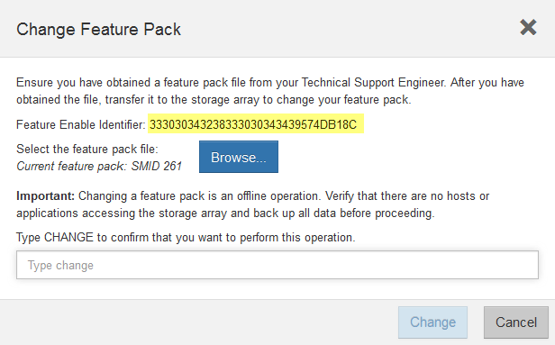

= 更改主机协议-5700
:allow-uri-read: 
:experimental: 
:icons: font
:imagesdir: ../media/

[role="lead"]
对于 E5700 存储阵列，您可以按如下所示转换基板主机端口：

* 光纤通道（ FC ）到 iSCSI
* iSCSI 到 FC
* iSER 到 InfiniBand （ IB ）
* SRP 到 IB
* NVMe 到 IB
* NVMe 到 RoCE

== 第 1 步：确定您是否具有双协议 SFP

使用 SANtricity 系统管理器确定您拥有的 SFP 收发器类型。由于这些 SFP 可以与 FC 和 iSCSI 协议结合使用，因此称为 _dual-protocol_ 或 _unified_SFP 。

如果您当前的 SFP 支持 16 Gbps 和 10 Gbps 的数据速率，则可以在转换主机端口协议后继续使用它们。

.步骤
. 在 SANtricity 系统管理器中，选择 * 支持 * 。
. 选择 * 支持中心 * 图块。
. 在支持资源选项卡上，找到并选择 * 存储阵列配置文件 * 链接。
. 在文本框中键入 * SFP * ，然后单击 * 查找 * 。
. 对于存储阵列配置文件中列出的每个 SFP ，找到 * 支持的数据速率 * 条目。
+
image::../media/sam1130_ss_e2800_unified_spf_maint-e5700.gif[支持的数据速率]

. 请参见下表以确定是否可以重复使用 SFP ，如下所示：
+
|===
| 支持的数据速率 | SFP 类型 | 支持的协议 

 a| 
16 Gbps ， 10 Gbps ， 4 Gbps
 a| 
双协议
 a| 
** * FC ： * 16 Gbps ， 4 Gbps
** **iSCSI ： 10.10 Gbps

 a| 
10 Gbps
 a| 
10 Gbps
 a| 
仅限 iSCSI

 a| 
16 Gbps ， 8 Gbps ， 4 Gbps
 a| 
16 Gbps
 a| 
仅限 FC

|===
+
** 如果您使用双协议 SFP ，则可以在转换协议后继续使用它们。
+

NOTE: 双协议 SFP 不支持 1 Gb iSCSI 。如果要将主机端口转换为 iSCSI ，请注意，双协议 SFP 仅支持与所连接端口的 10 Gb 链路。

** 如果您有 16 Gbps SFP ，并且要将主机端口转换为 iSCSI ，则必须在转换协议后删除这些 SFP 并将其替换为双协议或 10 Gbps SFP 。根据需要，您还可以使用带有 SFP 的专用双 AX 缆线使用 10 Gbps iSCSI 铜线。
+

NOTE: E28xx 或 E57xx 控制器不支持 8 Gbps FC SFP 。仅支持 16 Gbps 和 32 Gbps FC SFP 。

** 如果您有 10 Gbps SFP ，并且要将主机端口转换为 FC ，则必须在转换协议后从这些端口中删除 SFP ，并将其替换为双协议或 16 Gbps SFP 。

== 第 2 步：获取功能包

要获取功能包，您需要控制器架中的序列号，功能激活代码以及存储阵列的功能启用标识符。

.步骤
. 找到序列号。
+
.. 在 SANtricity 系统管理器中，选择菜单： Support[ 支持中心 ] 。
.. 选择 * 支持资源 * 选项卡后，滚动到 * 查看存储阵列顶部属性 * 部分。
.. 找到 * 机箱序列号 * ，并将此值复制到文本文件。
+
image::../media/sam1130_ss_e2800_storage_array_profile_sn_smid_copy_maint-e5700.gif[机箱序列号]

. 找到 * 功能包子型号 ID* 。
+
.. 在 SANtricity 系统管理器中，选择 * 支持 * 。
.. 选择 * 支持中心 * 图块。
.. 在支持资源选项卡上，找到并选择 * 存储阵列配置文件 * 链接。
.. 在文本框中键入 * 功能包子型号 ID* ，然后单击 * 查找 * 。
+

NOTE: "submodel"也可以写为"sub-model"。

.. 找到起始配置的功能包子型号 ID 。
+
image::../media/storage_array_profile2_maint-e5700.gif[功能包子模型ID]

. 使用功能包子型号 ID ，找到起始配置对应的控制器子型号 ID ，并在下表中找到所需结束配置的功能激活代码。然后，将该功能激活代码复制到文本文件。
+

NOTE: 在 HIC 上运行 NVMe 协议时，基板端口处于禁用状态。

+

NOTE: 如果不使用 IB HIC ，则可以忽略下表中的 _HIC Ports_ 列：

+
|===
5+| 支持加密的功能激活代码（仅限基板端口转换） 

2+| 正在启动配置 3+| 正在结束配置 

| 控制器子型号 ID | 要转换的端口 | 控制器子型号 ID | 端口转换为 | 功能激活代码 

 a| 
360
 a| 
FC 基板端口
 a| 
362.
 a| 
iSCSI 基板端口
 a| 
SGL-2SB-ZEX13

 a| 
362.
 a| 
iSCSI 基板端口
 a| 
360
 a| 
FC 基板端口
 a| 
5GI-4TA-ZW3HL

|===
+
|===
7+| 支持加密的功能激活代码 

3+| 正在启动配置 4+| 正在结束配置 

| 控制器子型号 ID | 基板端口 | HIC 端口 | 控制器子型号 ID | 基板端口 | HIC 端口 | 功能激活代码 

 a| 
360
 a| 
FC
 a| 
iSER
 a| 
361.
 a| 
FC
 a| 
SRP
 a| 
UGG-XSB-ZCZKU

 a| 
362.
 a| 
iSCSI
 a| 
iSER
 a| 
SGL-2SB-ZEX13

 a| 
363
 a| 
iSCSI
 a| 
SRP
 a| 
VGN-LTB-ZGFCT

 a| 
382-
 a| 
不可用
 a| 
NVMe/IB
 a| 
KGI-ISB-ZDCHF

 a| 
403
 a| 
不可用
 a| 
NVMe/RoCE 或 NVMe/FC
 a| 
YGH-BHK-Z8EKB

 a| 
361.
 a| 
FC
 a| 
SRP
 a| 
360
 a| 
FC
 a| 
iSER
 a| 
JGS-0TB-ZID1V

 a| 
362.
 a| 
iSCSI
 a| 
iSER
 a| 
UGX-RTB-ZLBPV

 a| 
363
 a| 
iSCSI
 a| 
SRP
 a| 
2G1-BTB-ZMRYN

 a| 
382-
 a| 
不可用
 a| 
NVMe/IB
 a| 
SGV — 8TB-ZKTH6

 a| 
403
 a| 
不可用
 a| 
NVMe/RoCE 或 NVMe/FC
 a| 
JGA-EIK ZAC6Q

 a| 
362.
 a| 
iSCSI
 a| 
iSER
 a| 
360
 a| 
FC
 a| 
iSER
 a| 
5GI-4TA-ZW3HL

 a| 
361.
 a| 
FC
 a| 
SRP
 a| 
EGL-NTB-ZXKQ4

 a| 
363
 a| 
iSCSI
 a| 
SRP
 a| 
HGP-qub-z1ICJ

 a| 
383.
 a| 
不可用
 a| 
NVMe/IB
 a| 
BGS-AUB-ZY二 G

 a| 
403
 a| 
不可用
 a| 
NVMe/RoCE 或 NVMe/FC
 a| 
1GW-Lik-ZG9HN

 a| 
363
 a| 
iSCSI
 a| 
SRP
 a| 
360
 a| 
FC
 a| 
iSER
 a| 
SGU-半 桶 -Z3G2U

 a| 
361.
 a| 
FC
 a| 
SRP
 a| 
fgs-dub-z5wf7

 a| 
362.
 a| 
iSCSI
 a| 
SRP
 a| 
LG3-GUB-Z7V17

 a| 
383.
 a| 
不可用
 a| 
NVMe/IB
 a| 
NG5-ZUB-Z8C8J

 a| 
403
 a| 
不可用
 a| 
NVMe/RoCE 或 NVMe/FC
 a| 
WG2-0IK ZI75U

 a| 
382-
 a| 
不可用
 a| 
NVMe/IB
 a| 
360
 a| 
FC
 a| 
iSER
 a| 
QGP-ETB-ZPPPT

 a| 
361.
 a| 
FC
 a| 
SRP
 a| 
xg8-XTB-ZQ7XS

 a| 
362.
 a| 
iSCSI
 a| 
iSER
 a| 
SGB-HTB-ZS0AH

 a| 
363
 a| 
iSCSI
 a| 
SRP
 a| 
TGD-1TB-ZTGTL

 a| 
403
 a| 
不可用
 a| 
NVMe/RoCE 或 NVMe/FC
 a| 
IGR-IIK-ZDBRB

 a| 
383.
 a| 
不可用
 a| 
NVMe/IB
 a| 
360
 a| 
FC
 a| 
iSER
 a| 
LG8 Jub ZATLD

 a| 
361.
 a| 
FC
 a| 
SRP
 a| 
LGA-3UB-ZBAX1

 a| 
362.
 a| 
iSCSI
 a| 
iSER
 a| 
NGF-7UB-ZE8KX

 a| 
363
 a| 
iSCSI
 a| 
SRP
 a| 
3GI-QUB-ZFP1 年

 a| 
403
 a| 
不可用
 a| 
NVMe/RoCE 或 NVMe/FC
 a| 
5GS-Rik-ZL5PE

 a| 
403
 a| 
不可用
 a| 
NVMe/RoCE 或 NVMe/FC
 a| 
360
 a| 
FC
 a| 
iSER
 a| 
BGC-UIK Z03GR

 a| 
361.
 a| 
FC
 a| 
SRP
 a| 
LGF-EIK ZPJRx

 a| 
362.
 a| 
iSCSI
 a| 
iSER
 a| 
PGJ-HIK-ZSIDZ

 a| 
363
 a| 
iSCSI
 a| 
SRP
 a| 
1GS-1JK-ZTYQX

 a| 
382-
 a| 
不可用
 a| 
NVMe/IB
 a| 
JGH-XIK — ZQ142

|===
+
|===
5+| 非加密功能激活代码（仅基板端口转换） 

2+| 正在启动配置 3+| 正在结束配置 

| 控制器子型号 ID | 要转换的端口 | 控制器子型号 ID | 端口转换为 | 功能激活代码 

 a| 
365
 a| 
FC 基板端口
 a| 
367
 a| 
iSCSI 基板端口
 a| 
BGU-GVB-ZM3KW

 a| 
367
 a| 
iSCSI 基板端口
 a| 
366.
 a| 
FC 基板端口
 a| 
9GU-2WB-Z503D

|===
+
|===
7+| 非加密功能激活代码 

3+| 正在启动配置 4+| 正在结束配置 

| 控制器子型号 ID | 基板端口 | HIC 端口 | 控制器子型号 ID | 基板端口 | HIC 端口 | 功能激活代码 

 a| 
365
 a| 
FC
 a| 
iSER
 a| 
366.
 a| 
FC
 a| 
SRP
 a| 
BGP — DVB — ZJ4YC

 a| 
367
 a| 
iSCSI
 a| 
iSER
 a| 
BGU-GVB-ZM3KW

 a| 
368
 a| 
iSCSI
 a| 
SRP
 a| 
4GX-ZVB-ZNJVD

 a| 
384
 a| 
不可用
 a| 
NVMe/IB
 a| 
TGS-WVB-ZKL9T

 a| 
405.
 a| 
不可用
 a| 
NVMe/RoCE 或 NVMe/FC
 a| 
WGC-GJK-Z7PU2

 a| 
366.
 a| 
FC
 a| 
SRP
 a| 
365
 a| 
FC
 a| 
iSER
 a| 
WG2-3VB-ZQHLF

 a| 
367
 a| 
iSCSI
 a| 
iSER
 a| 
QGS-6VB-ZSF8M

 a| 
368
 a| 
iSCSI
 a| 
SRP
 a| 
PGA-PVB-ZUWMX

 a| 
384
 a| 
不可用
 a| 
NVMe/IB
 a| 
CG5-MVB-ZRYW1

 a| 
405.
 a| 
不可用
 a| 
NVMe/RoCE 或 NVMe/FC
 a| 
3GH-JJK-ZANJQ

 a| 
367
 a| 
iSCSI
 a| 
iSER
 a| 
365
 a| 
FC
 a| 
iSER
 a| 
PGR-IWB-Z48PC

 a| 
366.
 a| 
FC
 a| 
SRP
 a| 
9GU-2WB-Z503D

 a| 
368
 a| 
iSCSI
 a| 
SRP
 a| 
SGJ-IWB-ZJFE4.

 a| 
385%
 a| 
不可用
 a| 
NVMe/IB
 a| 
UGG-2XB-ZKV0B

 a| 
405.
 a| 
不可用
 a| 
NVMe/RoCE 或 NVMe/FC
 a| 
8GR-QKKA-ZFJTP

 a| 
368
 a| 
iSCSI
 a| 
SRP
 a| 
365
 a| 
FC
 a| 
iSER
 a| 
YG0-LXB-ZLD26

 a| 
366.
 a| 
FC
 a| 
SRP
 a| 
SGR-5XB-ZNTFB

 a| 
367
 a| 
iSCSI
 a| 
SRP
 a| 
PGZ-5WB-Z8M0N

 a| 
385%
 a| 
不可用
 a| 
NVMe/IB
 a| 
KG2-0WB-Z9477

 a| 
405.
 a| 
不可用
 a| 
NVMe/RoCE 或 NVMe/FC
 a| 
2GV — TKK — ZIBI6

 a| 
384
 a| 
不可用
 a| 
NVMe/IB
 a| 
365
 a| 
FC
 a| 
iSER
 a| 
SGF-SVB-ZWU9M

 a| 
366.
 a| 
FC
 a| 
SRP
 a| 
7GH-CVB-ZYBGV

 a| 
367
 a| 
iSCSI
 a| 
iSER
 a| 
6GK-VVVB-ZZSRN

 a| 
368
 a| 
iSCSI
 a| 
SRP
 a| 
RMG-fwb-Z195H

 a| 
405.
 a| 
不可用
 a| 
NVMe/RoCE 或 NVMe/FC
 a| 
VGA-NKK-ZDLDK

 a| 
385%
 a| 
不可用
 a| 
NVMe/IB
 a| 
365
 a| 
FC
 a| 
iSER
 a| 
G5-8WB-ZBEM

 a| 
366.
 a| 
FC
 a| 
SRP
 a| 
KG7-RWB-ZC2RZ

 a| 
367
 a| 
iSCSI
 a| 
iSER
 a| 
NGC-VWB-ZFZEN

 a| 
368
 a| 
iSCSI
 a| 
SRP
 a| 
4GE-fwb-ZGGQJ

 a| 
405.
 a| 
不可用
 a| 
NVMe/RoCE 或 NVMe/FC
 a| 
NG1-WKK-ZLFAI

 a| 
405.
 a| 
不可用
 a| 
NVMe/RoCE 或 NVMe/FC
 a| 
365
 a| 
FC
 a| 
iSER
 a| 
MGC-ZKKC-ZNDVC

 a| 
366.
 a| 
FC
 a| 
SRP
 a| 
｛ \f590 ｝ ｛ \f590 ｝ ｛ \f590 ｝ ｛ \f590 ｝

 a| 
367
 a| 
iSCSI
 a| 
iSER
 a| 
ng-mk-zRSW9

 a| 
368
 a| 
iSCSI
 a| 
SRP
 a| 
VGG-6KG-ZT9BU

 a| 
384
 a| 
不可用
 a| 
NVMe/IB
 a| 
AGB-3KB-ZQBRR

|===
+

NOTE: 如果未列出您的控制器子型号 ID ，请联系 http://mysupport.netapp.com["NetApp 支持"^]。

. 在 System Manager 中，找到功能启用标识符。
+
.. 转到菜单：设置 [ 系统 ] 。
.. 向下滚动到 * 加载项 * 。
.. 在 * 更改功能包 * 下，找到 * 功能启用标识符 * 。
.. 将此 32 位数字复制并粘贴到文本文件中。
+

. 转至 http://partnerspfk.netapp.com["NetApp 许可证激活：存储阵列高级功能激活"^]，并输入获取功能包所需的信息。
+
** 机箱序列号
** 功能激活代码
** 功能启用标识符
+

NOTE: 高级功能激活网站提供了一个链接，指向 "`高级功能激活说明 " 。` 请勿尝试对此操作步骤使用这些说明。

. 选择是通过电子邮件接收功能包的密钥文件，还是直接从站点下载。

== 第 3 步：停止主机 I/O

在转换主机端口的协议之前，请停止主机上的所有 I/O 操作。在成功完成转换之前，您无法访问存储阵列上的数据。

只有在转换已使用的存储阵列时，此任务才适用。

.步骤
. 确保存储阵列与所有已连接主机之间未发生任何 I/O 操作。例如，您可以执行以下步骤：
+
** 停止涉及从存储映射到主机的 LUN 的所有进程。
** 确保没有应用程序向从存储映射到主机的任何 LUN 写入数据。
** 卸载与阵列上的卷关联的所有文件系统。
+

NOTE: 停止主机 I/O 操作的确切步骤取决于主机操作系统和配置，这些步骤不在本说明的范围之内。如果您不确定如何停止环境中的主机 I/O 操作，请考虑关闭主机。

+

CAUTION: * 可能的数据丢失 * - 如果在执行 I/O 操作时继续执行此操作步骤，则主机应用程序可能会丢失数据，因为无法访问存储阵列。

. 如果存储阵列参与镜像关系，请停止二级存储阵列上的所有主机 I/O 操作。
. 等待缓存中的所有数据写入驱动器。
+
需要将缓存数据写入驱动器时，每个控制器背面的绿色缓存活动 LED * （ 1 ） * 亮起。您必须等待此LED熄灭。image:../media/e5700_ib_hic_w_cache_led_callouts_maint-e5700.gif["E5700控制器上的缓存活动LED"]

. 从 SANtricity 系统管理器的主页页面中，选择 * 查看正在执行的操作 * 。
. 等待所有操作完成，然后再继续下一步。

== 第 4 步：更改功能包

更改功能包以转换基板主机端口， IB HIC 端口或这两种类型的端口的主机协议。

.步骤
. 在 SANtricity 系统管理器中，选择菜单：设置 [ 系统 ] 。
. 在 * 加载项 * 下，选择 * 更改功能包 * 。
+
image::../media/sam1130_ss_system_change_feature_pack_maint-e5700.gif[更改功能包]

. 单击 * 浏览 * ，然后选择要应用的功能包。
. 在字段中键入 * 更改 * 。
. 单击 * 更改 * 。
+
开始迁移功能包。两个控制器都会自动重新启动两次，以使新功能包生效。重新启动完成后，存储阵列将恢复为响应状态。

. 确认主机端口具有所需的协议。
+
.. 在 SANtricity 系统管理器中，选择 * 硬件 * 。
.. 单击 * 显示磁盘架的背面 * 。
.. 选择控制器 A 或控制器 B 的图形
.. 从上下文菜单中选择 * 查看设置 * 。
.. 选择 * 主机接口 * 选项卡。
.. 单击 * 显示更多设置 * 。
.. 查看所示的基板端口和 HIC 端口（标记为 " `slot 1` " ）的详细信息，并确认每种类型的端口都具有您期望的协议。

.下一步是什么？
转至 link:hpp-complete-protocol-conversion-task.html["完成主机协议转换"]。
