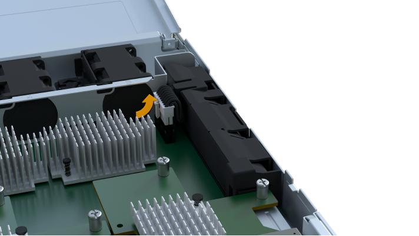

= 更换 EF300 或 EF600 电池
:allow-uri-read: 
:experimental: 
:icons: font
:imagesdir: ../media/

[role="lead"]
您可以更换 EF300 或 EF600 存储系统中的电池。

.关于此任务
每个控制器箱都包含一个电池，用于在交流电源发生故障时保留缓存的数据。如果 SANtricity System Manager 中的恢复 Guru 报告电池故障状态或需要更换电池状态，则必须更换受影响的电池。

.开始之前
* 验证是否未使用任何卷，或者是否已在使用这些卷的所有主机上安装多路径驱动程序。
* 查看 link:batteries-overview-requirements-concept.html["更换 EF300 或 EF600 电池的要求"]。
* 确保您已具备以下条件：
+
** 更换电池。
** ESD腕带或其他防静电预防措施。
** 一个无静电的平面工作区。
** 用于标识连接到控制器箱的每个缆线的标签。
** 一个管理工作站，其浏览器可访问控制器的 SANtricity 系统管理器。（要打开 System Manager 界面，请将浏览器指向控制器的域名或 IP 地址。）

== 第 1 步：使控制器脱机

备份数据并使受影响的控制器脱机。

.步骤
. 在 SANtricity 系统管理器中，查看恢复 Guru 中的详细信息，确认问题描述具有电池，并确保不需要先解决任何其他问题。
. 从 Recovery Guru 的 Details 区域中，确定要更换的电池。
. 使用 SANtricity 系统管理器备份存储阵列的配置数据库。
+
如果删除控制器时出现问题，您可以使用保存的文件还原配置。系统将保存 RAID 配置数据库的当前状态，其中包括控制器上卷组和磁盘池的所有数据。

+
** 在 System Manager 中：
+
... 选择菜单： Support[ 支持中心 > 诊断 ] 。
... 选择 * 收集配置数据 * 。
... 单击 * 收集 * 。
+
此文件将保存在浏览器的 "Downloads" 文件夹中，名为 * configurationData-<arrayName>-<DateTime>.7z* 。

. 如果控制器尚未脱机，请立即使用 SANtricity 系统管理器将其脱机。
+
.. 选择 * 硬件 * 。
.. 如果图形显示了驱动器，请选择 * 显示磁盘架背面 * 以显示控制器。
.. 选择要置于脱机状态的控制器。
.. 从上下文菜单中，选择 * 置于脱机状态 * ，然后确认要执行此操作。
+

NOTE: 如果您正在使用尝试脱机的控制器访问 SANtricity 系统管理器，则会显示 SANtricity 系统管理器不可用消息。选择 * 连接到备用网络连接 * 以使用另一个控制器自动访问 SANtricity 系统管理器。

. 等待 SANtricity System Manager 将控制器状态更新为脱机。
+

NOTE: 更新状态之前，请勿开始任何其他操作。

. 从 Recovery Guru 中选择 * 重新检查 * ，然后确认详细信息区域中的确定删除字段显示是，表示可以安全删除此组件。

== 第 2 步：拆下控制器箱

将故障电池更换为新电池。

.步骤
. 戴上 ESD 腕带或采取其他防静电预防措施。
. 为连接到控制器箱的每个缆线贴上标签。
. 断开控制器箱的所有缆线。
+

CAUTION: To prevent degraded performance, do not twist, fold, pinch, or step on the cables.

. 确认控制器背面的缓存活动 LED 是否熄灭。
. 按压控制器两侧的手柄，然后向后拉，直到其从磁盘架中释放为止。
+
image::../media/remove_controller_5.png[挤压手柄以卸下控制器]

. 用两只手和把手将控制器箱滑出磁盘架。如果控制器的正面没有机箱，请用两只手将其完全拉出。
+

CAUTION: 始终用双手支撑控制器箱的重量。

+
image::../media/remove_controller_6.png[拆下控制器时，用双手支撑控制器的重量]

. 将控制器箱放在无静电的平面上。

== 第 3 步：取出故障电池

将故障电池从控制器中拉出。

.步骤
. 拧下单个翼形螺钉并提起控制器箱盖，以卸下控制器箱盖。
. 确认控制器中的绿色 LED 是否熄灭。
+
如果此绿色 LED 亮起，则表示控制器仍在使用电池电源。您必须等待此 LED 熄灭，然后才能卸下任何组件。

. 找到控制器侧面的 " 按下 " 选项卡。
. 按下卡舌并挤压电池外壳，以解锁电池。
+
image::../media/batt_3.png["按下卡舌以解锁电池]

. 轻轻挤压用于存放电池接线的连接器。向上拉，断开电池与板的连接。
+

. 将电池从控制器中提出，并放在无静电的平面上。
+
image::../media/batt_4.png[从控制器中取出电池]

. 按照您所在地区的相应过程回收或处置故障电池。
+

CAUTION: 为了遵守国际航空运输协会（ IATA ）的规定，请勿通过空中运输电池，除非将其安装在控制器架中。

== 第 4 步：安装新电池

从控制器箱中取出故障电池后，请按照此步骤安装新电池。

.步骤
. 拆开新电池的包装，将其放在无静电的平面上。
+

NOTE: 为了安全地遵守 IATA 规定，更换电池在发货时的荷电状态（ SoC ）不超过 30% 。重新接通电源时，请记住，在更换电池充满电且完成初始学习周期之前，写入缓存不会恢复。

. 通过将电池外壳与控制器侧面的金属闩锁对齐，将电池插入控制器。
+
image::../media/batt_5.png[插入电池]

+
电池卡入到位。

. 将电池连接器重新插入板中。

== 第 5 步：重新安装控制器箱

将控制器重新安装到控制器架中。

.步骤
. 降低控制器箱上的盖板并固定翼形螺钉。
. 在挤压控制器把手的同时，将控制器箱轻轻滑入控制器架中。
+

NOTE: 正确安装到磁盘架后，控制器会发出卡嗒声。

+
image::../media/remove_controller_7.png[将控制器安装到磁盘架中]

== 第 6 步：完成电池更换

将控制器置于联机状态，收集支持数据并恢复操作。

.步骤
. 将控制器置于联机状态。
+
.. 在 System Manager 中，导航到硬件页面。
.. 选择 * 显示控制器的背面 * 。
.. 选择已更换电池的控制器。
.. 从下拉列表中选择 * 置于联机状态 * 。

. 在控制器启动时，检查控制器 LED 。
+
重新建立与另一控制器的通信时：

+
** 琥珀色警示 LED 仍保持亮起状态。
** 主机链路 LED 可能亮起，闪烁或熄灭，具体取决于主机接口。

. 控制器恢复联机后，确认其状态为最佳，并检查控制器架的警示 LED 。
+
如果状态不是最佳状态，或者任何警示 LED 均亮起，请确认所有缆线均已正确就位，并且控制器箱已正确安装。如有必要，请拆下并重新安装控制器箱。

+

NOTE: 如果无法解决此问题，请联系技术支持。

. 单击菜单： Support[ 升级中心 ] 以确保已安装最新版本的 SANtricity OS 。
+
根据需要安装最新版本。

. 验证所有卷是否均已返回到首选所有者。
+
.. 选择菜单： Storage[Volumes] 。在 * 所有卷 * 页面中，验证卷是否已分发到其首选所有者。选择菜单：更多 [ 更改所有权 ] 以查看卷所有者。
.. 如果卷全部归首选所有者所有，请继续执行步骤 6 。
.. 如果未返回任何卷，则必须手动返回这些卷。转到菜单：更多 [ 重新分配卷 ] 。
.. 如果在自动分发或手动分发后，只有部分卷返回给其首选所有者，则必须检查 Recovery Guru 以了解主机连接问题。
.. 如果不存在 Recovery Guru ，或者按照恢复 Guru 步骤执行操作，则卷仍不会返回到其首选所有者联系支持部门。

. 使用 SANtricity 系统管理器收集存储阵列的支持数据。
+
.. 选择菜单： Support[ 支持中心 > 诊断 ] 。
.. 选择 * 收集支持数据 * 。
.. 单击 * 收集 * 。
+
此文件将保存在浏览器的 "Downloads" 文件夹中，名为 * support-data.7z* 。

.下一步是什么？
您的电池更换已完成。您可以恢复正常操作。
