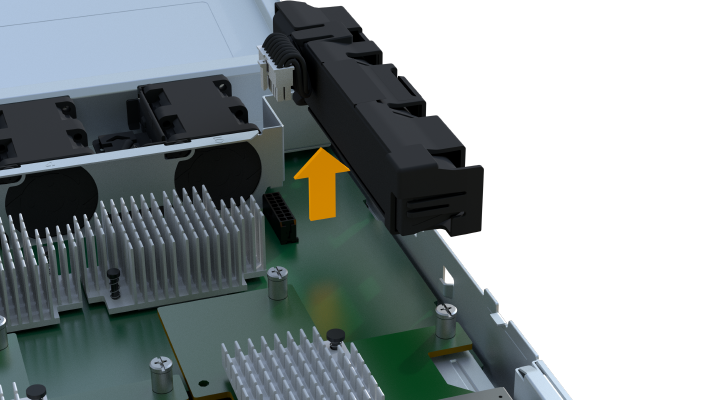

= 更换 EF300 或 EF600 控制器
:allow-uri-read: 
:experimental: 
:icons: font
:imagesdir: ../media/

[role="lead"]
您可以更换 EF300 或 EF600 控制器架中的单个控制器。

更换发生故障的控制器箱时，您必须从原始控制器箱中取出电池，电源， DIMM ，风扇和主机接口卡（ HIC ），然后将其安装到替代控制器箱中。

.开始之前
* 请查看 link:controllers-overview-supertask-concept.html["更换 EF300 或 EF600 控制器的要求"]。
* 通过以下两种方式之一确定控制器箱是否发生故障：
+
** SANtricity System Manager 中的恢复 Guru 可指示您更换控制器箱。
** 控制器箱上的琥珀色警示 LED 亮起，表示控制器出现故障。

.您需要什么？ #8217 ；将需要什么
* 与要更换的控制器箱部件号相同的替代控制器箱。
* ESD 腕带，或者您已采取其他防静电预防措施。
* 一个无静电的平面工作区。
* 1 号十字螺丝刀
* 用于标识连接到控制器箱的每个缆线的标签。
* 一个管理工作站，其浏览器可访问控制器的 SANtricity 系统管理器。（要打开 System Manager 界面，请将浏览器指向控制器的域名或 IP 地址。）

== 第 1 步：准备更换控制器

通过验证更换用的控制器箱是否具有正确的 FRU 部件号，备份配置并收集支持数据，准备更换出现故障的控制器箱。

.步骤
. 拆开新控制器箱的包装，将其放在无静电的平面上。
+
请保存包装材料，以便在运输故障控制器箱时使用。

. 找到控制器箱背面的 MAC 地址和 FRU 部件号标签。
. 在 SANtricity 系统管理器中，找到要更换的控制器箱的更换部件号。
+
如果控制器出现故障并需要更换，则更换部件号将显示在 Recovery Guru 的 Details 区域中。如果您需要手动查找此编号，请按照以下步骤操作：

+
.. 选择 * 硬件 * 。
.. 找到标记有控制器图标的控制器架 image:../media/sam1130_ss_hardware_controller_icon_maint-ef600.gif[""]。
.. 单击控制器图标。
.. 选择控制器，然后单击 * 下一步 * 。
.. 在 * 基本 * 选项卡上，记下控制器的 * 更换部件号 * 。

. 确认故障控制器的更换部件号与更换控制器的 FRU 部件号相同。
+

CAUTION: * 可能会丢失数据访问 * - 如果两部分编号不同，请勿尝试使用此操作步骤。此外，如果发生故障的控制器箱包含主机接口卡（ HIC ），则必须将该 HIC 安装到新的控制器箱中。如果存在不匹配的控制器或 HIC ，则会导致新控制器在联机时锁定。

. 使用 SANtricity 系统管理器备份存储阵列的配置数据库。
+
如果删除控制器时出现问题，您可以使用保存的文件还原配置。系统将保存 RAID 配置数据库的当前状态，其中包括控制器上卷组和磁盘池的所有数据。

+
** 在 System Manager 中：
+
... 选择菜单： Support[ 支持中心 > 诊断 ] 。
... 选择 * 收集配置数据 * 。
... 单击 * 收集 * 。
+
此文件将保存在浏览器的 "Downloads" 文件夹中，名为 * configurationData-<arrayName>-<DateTime>.7z* 。

. 如果控制器尚未脱机，请立即使用 SANtricity 系统管理器将其脱机。
+
.. 选择 * 硬件 * 。
.. 如果图形显示了驱动器，请选择 * 显示磁盘架背面 * 以显示控制器。
.. 选择要置于脱机状态的控制器。
.. 从上下文菜单中，选择 * 置于脱机状态 * ，然后确认要执行此操作。

+

NOTE: 如果您正在使用尝试脱机的控制器访问 SANtricity 系统管理器，则会显示 SANtricity 系统管理器不可用消息。选择 * 连接到备用网络连接 * 以使用另一个控制器自动访问 SANtricity 系统管理器。

. 等待 SANtricity System Manager 将控制器状态更新为脱机。
+

CAUTION: 更新状态之前，请勿开始任何其他操作。

. 从 Recovery Guru 中选择 * 重新检查 * ，然后确认详细信息区域中的 * 确定删除 * 字段显示 * 是 * ，表示可以安全删除此组件。

== 第 2 步：删除故障控制器

拆下一个控制器箱，将故障箱更换为一个新的控制器箱。

这是一个多步骤操作步骤，需要您卸下以下组件：电池，主机接口卡，电源， DIMM 和风扇。

=== 步骤 2a ：卸下控制器箱

拆下发生故障的控制器箱，以便用新的控制器箱进行更换。

.步骤
. 戴上 ESD 腕带或采取其他防静电预防措施。
. 为连接到控制器箱的每个缆线贴上标签。
. 断开控制器箱的所有缆线。
+

CAUTION: To prevent degraded performance, do not twist, fold, pinch, or step on the cables.

. 如果控制器箱中的 HIC 使用 SFP+ 收发器，请卸下 SFP 。
+
由于必须从故障控制器箱中卸下 HIC ，因此必须从 HIC 端口中卸下所有 SFP 。重新连接缆线后，您可以将这些 SFP 移至新控制器箱。

. 确认控制器背面的缓存活动 LED 是否熄灭。
. 按压控制器两侧的手柄，然后向后拉，直到其从磁盘架中释放为止。
+
image::../media/remove_controller_5.png[删除控制器 5]

. 用两只手和把手将控制器箱滑出磁盘架。如果控制器的正面没有机箱，请用两只手将其完全拉出。
+

CAUTION: 始终用双手支撑控制器箱的重量。

+
image::../media/remove_controller_6.png[删除控制器 6]

. 将控制器箱放在无静电的平面上。

=== 步骤 2b ：取出电池

从发生故障的控制器箱中取出电池，以便将其安装到新的控制器箱中。

.步骤
. 拧下单个翼形螺钉并提起控制器箱盖，以卸下控制器箱盖。
. 找到控制器侧面的 " 按下 " 选项卡。
. 按下卡舌并挤压电池外壳，以解锁电池。
+
image::../media/batt_3.png[电池 3]

. 轻轻挤压用于存放电池接线的连接器。向上拉，断开电池与板的连接。image:../media/batt_2.png[""]
. 将电池从控制器中提出，并放在无静电的平面上。

=== 第 2c 步：删除 HIC

如果控制器箱包含 HIC ，则必须从原始控制器箱中卸下 HIC 。否则，您可以跳过此步骤。

.步骤
. 使用十字螺丝刀卸下将 HIC 面板连接到控制器箱的两个螺钉。
+
image::../media/hic_2.png[HIC 2.]

+

NOTE: 上图为示例， HIC 的外观可能有所不同。

. 卸下 HIC 面板。
. 使用您的手指或十字螺丝刀松开将 HIC 固定到控制器卡的单个翼形螺钉。
+
image::../media/hic_3.png[HIC 3.]

+

NOTE: HIC 顶部有三个螺钉位置，但仅使用一个螺钉位置进行固定。

. 小心地将 HIC 从控制器卡上取下并从控制器中取出。
+

CAUTION: 请注意，不要擦除或撞击 HIC 底部或控制器卡顶部的组件。

+
image::../media/hic_4.png[HIC 4.]

. 将 HIC 放在无静电的平面上。

=== 步骤 2D ：卸下电源

卸下电源，以便将其安装到新控制器中。

.步骤
. 断开电源线：
+
.. 打开电源线固定器，然后从电源拔下电源线。
.. 从电源设备拔下电源线。

. 找到电源右侧的卡舌，然后将其推向电源设备。
+
image::../media/psup_2.png[PSUP 2.]

. 找到电源正面的手柄。
. 使用把手将电源直接滑出系统。
+
image::../media/psup_3.png[PSUP 3.]

+

CAUTION: When removing a power supply, always use two hands to support its weight.

=== 步骤 2e ：卸下 DIMM

卸下 DIMM ，以便将其安装到新控制器中。

.步骤
. 找到控制器上的 DIMM 。
. Note the orientation of the DIMM in the socket so that you can insert the replacement DIMM in the proper orientation.
+

NOTE: DIMM 底部的缺口可帮助您在安装期间对齐 DIMM 。

. 缓慢推离 DIMM 两侧的两个 DIMM 弹出器卡舌，以便从插槽中弹出 DIMM ，然后将其滑出插槽。
+

NOTE: Carefully hold the DIMM by the edges to avoid pressure on the components on the DIMM circuit board.

+
image::../media/dimm_2.png[DIMM 2]

+
image::../media/dimim_3.png[dimim 3.]

=== 步骤 2f ：卸下风扇

卸下风扇，以便将其安装到新控制器中。

.步骤
. 从控制器中轻轻提起风扇。
+
image::../media/fan_2.png[风扇 2]

. 重复此步骤，直到卸下所有风扇为止。

== 第 3 步：安装新控制器

安装新的控制器箱以更换出现故障的控制器箱。

这是一个多步骤操作步骤，需要从原始控制器安装以下组件：电池，主机接口卡，电源， DIMM 和风扇。

=== 步骤 3a ：安装电池

将电池安装到更换用的控制器箱中。

.步骤
. 确保您已：
+
** 原始控制器箱中的电池或您订购的新电池。
** 替代控制器箱。

. 通过将电池外壳与控制器侧面的金属闩锁对齐，将电池插入控制器。
+
image::../media/batt_5.png[电池 5]

+
电池卡入到位。

. 将电池连接器重新插入板中。

=== 第 3b 步：安装 HIC

如果从原始控制器箱中取出了 HIC ，则必须将该 HIC 安装到新控制器箱中。否则，您可以跳过此步骤。

.步骤
. 使用 1 号十字螺丝刀卸下将空白面板连接到更换用控制器箱的两个螺钉，然后卸下面板。
. 将 HIC 上的单个翼形螺钉与控制器上的相应孔对齐，并将 HIC 底部的连接器与控制器卡上的 HIC 接口连接器对齐。
+
请注意，不要擦除或撞击 HIC 底部或控制器卡顶部的组件。

+
image::../media/hic_7.png[HIC 7.]

+

NOTE: 上图为示例； HIC 的外观可能有所不同。

. 小心地将 HIC 放低到位，然后轻按 HIC 以固定 HIC 连接器。
+

CAUTION: * 可能的设备损坏 * —请务必小心，不要挤压 HIC 和翼形螺钉之间控制器 LED 的金带连接器。

. 手动拧紧 HIC 翼形螺钉。
+
请勿使用螺丝刀，否则可能会过度拧紧螺钉。

+
image::../media/hic_3.png[HIC 3.]

+

NOTE: 上图为示例； HIC 的外观可能有所不同。

. 使用 1 号十字螺丝刀，使用两个螺钉将从原始控制器箱中卸下的 HIC 面板连接到新控制器箱。

=== 步骤 3c ：安装电源

将电源安装到更换用的控制器箱中。

.步骤
. Using both hands, support and align the edges of the power supply with the opening in the system chassis, and then gently push the power supply into the chassis using the cam handle.
+
The power supplies are keyed and can only be installed one way.

+

CAUTION: 将电源滑入系统时，请勿用力过大；否则可能会损坏连接器。

+
image::../media/psup_4.png[PSUP 4.]

=== 步骤 3D ：安装 DIMM

将 DIMM 安装到新控制器箱中。

.步骤
. 拿住 DIMM 的边角，并将其与插槽对齐。
+
The notch among the pins on the DIMM should line up with the tab in the socket.

. Insert the DIMM squarely into the slot.
+
image::../media/dimm_4.png[DIMM 4.]

+
The DIMM fits tightly in the slot, but should go in easily.If not, realign the DIMM with the slot and reinsert it.

+

NOTE: Visually inspect the DIMM to verify that it is evenly aligned and fully inserted into the slot.

. 小心而稳固地推动 DIMM 的上边缘，直到闩锁卡入到位，位于 DIMM 两端的缺口上。
+

NOTE: DIMM 紧密贴合。您可能需要一次轻轻按压一侧，并分别固定每个卡舌。

+
image::../media/dimm_5.png[DIMM 5]

=== 步骤 3e ：安装风扇

将风扇安装到更换用的控制器箱中。

.步骤
. 将风扇完全滑入更换用的控制器中。
+
image::../media/fan_3.png[风扇 3]

+
image::../media/fan_3_a.png[风扇 3 A]

. 重复此步骤，直到安装完所有风扇为止。

=== 步骤 3f ：安装新的控制器箱

最后，将新控制器箱安装到控制器架中。

.步骤
. 降低控制器箱上的盖板并固定翼形螺钉。
. 在挤压控制器把手的同时，将控制器箱轻轻滑入控制器架中。
+

NOTE: 正确安装到磁盘架后，控制器会发出卡嗒声。

+
image::../media/remove_controller_7.png[卸下控制器 7]

. 如果 SFP 安装在原始控制器中，请将其从原始控制器安装在新控制器的主机端口中，然后重新连接所有缆线。
+
如果使用多个主机协议，请确保将 SFP 安装在正确的主机端口中。

. 如果原始控制器使用 DHCP 作为 IP 地址，请在替代控制器背面的标签上找到 MAC 地址。请您的网络管理员将您删除的控制器的 DNS/network 和 IP 地址与替代控制器的 MAC 地址相关联。
+

NOTE: 如果原始控制器未使用 DHCP 作为 IP 地址，则新控制器将采用您删除的控制器的 IP 地址。

== 第 4 步：完成控制器更换

将控制器置于联机状态，收集支持数据并恢复操作。

.步骤
. 将控制器置于联机状态。
+
.. 在 System Manager 中，导航到硬件页面。
.. 选择 * 显示控制器的背面 * 。
.. 选择更换的控制器。
.. 从下拉列表中选择 * 置于联机状态 * 。

. 在控制器启动时，检查控制器 LED 。
+
重新建立与另一控制器的通信时：

+
** 琥珀色警示 LED 仍保持亮起状态。
** 主机链路 LED 可能亮起，闪烁或熄灭，具体取决于主机接口。

. 控制器恢复联机后，确认其状态为最佳，并检查控制器架的警示 LED 。
+
如果状态不是最佳状态，或者任何警示 LED 均亮起，请确认所有缆线均已正确就位，并且控制器箱已正确安装。如有必要，请拆下并重新安装控制器箱。

+

NOTE: 如果无法解决此问题，请联系技术支持。

. 单击菜单： Hardware[ 支持 > 升级中心 ] 以确保已安装最新版本的 SANtricity OS 。
+
根据需要安装最新版本。

. 验证所有卷是否均已返回到首选所有者。
+
.. 选择菜单： Storage[Volumes] 。在 * 所有卷 * 页面中，验证卷是否已分发到其首选所有者。选择菜单：更多 [ 更改所有权 ] 以查看卷所有者。
.. 如果卷全部归首选所有者所有，请继续执行步骤 6 。
.. 如果未返回任何卷，则必须手动返回这些卷。转到菜单：更多 [ 重新分配卷 ] 。
.. 如果在自动分发或手动分发后，只有部分卷返回给其首选所有者，则必须检查 Recovery Guru 以了解主机连接问题。
.. 如果不存在 Recovery Guru ，或者按照恢复 Guru 步骤执行操作，则卷仍不会返回到其首选所有者联系支持部门。

. 使用 SANtricity 系统管理器收集存储阵列的支持数据。
+
.. 选择菜单： Support[ 支持中心 > 诊断 ] 。
.. 选择 * 收集支持数据 * 。
.. 单击 * 收集 * 。
+
此文件将保存在浏览器的 "Downloads" 文件夹中，名为 * support-data.7z* 。

控制器更换已完成。您可以恢复正常操作。
