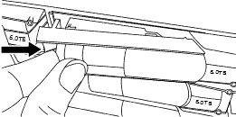

= 更换驱动器- EF300
:allow-uri-read: 
:icons: font
:imagesdir: ../media/

[role="lead"]
您可以更换EF300或EF300C阵列中的驱动器。

EF300和EF300C支持SAS扩展、可容纳24个驱动器和60个驱动器的磁盘架。您关注的操作步骤取决于您使用的是 24 驱动器磁盘架还是 60 驱动器磁盘架：

* <<更换 EF300 中的驱动器（ 24 驱动器磁盘架）>>
* <<更换 EF300 中的驱动器（ 60 个驱动器磁盘架）>>

== 更换 EF300 中的驱动器（ 24 驱动器磁盘架）

按照此操作步骤更换 24 驱动器磁盘架中的驱动器。

.关于此任务
SANtricity System Manager 中的恢复 Guru 可监控存储阵列中的驱动器，并可通知您即将发生的驱动器故障或实际发生的驱动器故障。驱动器发生故障时，其琥珀色警示 LED 亮起。您可以在存储阵列接收 I/O 时热插拔故障驱动器

.开始之前
* 查看中的驱动器处理要求 link:drives-overview-supertask-concept.html["更换 EF300 或 EF600 驱动器的要求"]。
* 确保您已具备以下条件：
+
** NetApp 为您的控制器架或驱动器架支持的替代驱动器。
** ESD 腕带，或者您已采取其他防静电预防措施。
** 一个无静电的平面。
** 一个管理工作站，其浏览器可访问控制器的 SANtricity 系统管理器。（要打开 System Manager 界面，请将浏览器指向控制器的域名或 IP 地址。）

=== 第 1 步：准备更换驱动器（ 24 个驱动器）

检查 SANtricity System Manager 中的恢复 Guru 并完成所有前提步骤，以便准备更换驱动器。然后，您可以找到故障组件。

.步骤
. 如果 SANtricity System Manager 中的恢复 Guru 已通知您驱动器出现 _ 即将发生故障 _ ，但驱动器尚未出现故障，请按照恢复 Guru 中的说明对驱动器进行故障转移。
. 如果需要，请使用 SANtricity 系统管理器确认您有合适的替代驱动器。
+
.. 选择 * 硬件 * 。
.. 在磁盘架图中选择故障驱动器。
.. 单击驱动器以显示其上下文菜单，然后选择 * 查看设置 * 。
.. 确认替代驱动器的容量等于或大于要更换的驱动器，并且具有您期望的功能。
+
例如，不要尝试将硬盘驱动器（ HDD ）更换为固态驱动器（ SSD ）。同样，如果要更换支持安全保护的驱动器，请确保更换的驱动器也支持安全保护。

. 如果需要，请使用 SANtricity 系统管理器查找存储阵列中的驱动器：从驱动器的上下文菜单中，选择 * 打开定位灯 * 。
+
驱动器的警示 LED （琥珀色）将闪烁，以便您确定要更换的驱动器。

+

NOTE: 如果要更换具有挡板的磁盘架中的驱动器，则必须卸下挡板才能看到驱动器 LED 。

=== 第 2 步：删除故障驱动器（ 24 个驱动器）

删除故障驱动器以更换为新驱动器。

.步骤
. 拆开备用驱动器的包装，并将其放在磁盘架附近的无静电平面上。
+
节省所有包装材料。

. 按下故障驱动器上的释放按钮。
+

+
** 对于 E5724 控制器架或 DE224C 驱动器架中的驱动器，释放按钮位于驱动器顶部。驱动器弹簧上的凸轮把手部分打开，驱动器从中板释放。

. 打开凸轮把手，然后轻轻滑出驱动器。
. Wait 60 seconds.
. 用双手将驱动器从磁盘架中取出。
. Place the drive on an antistatic, cushioned surface away from magnetic fields.
. 等待 60 秒，使软件识别出驱动器已被删除。
+

NOTE: 如果您意外删除了活动驱动器，请至少等待 60 秒，然后重新安装它。有关恢复操作步骤，请参阅存储管理软件。

=== 第 3 步：安装新驱动器（ 24 个驱动器）

您需要安装一个新驱动器来更换发生故障的驱动器。删除故障驱动器后，请尽快安装替代驱动器。否则，设备可能会过热。

.步骤
. 打开凸轮把手。
. 用两只手将替代驱动器插入打开的托架中，用力推动，直到驱动器停止为止。
. 慢慢合上凸轮把手，直到驱动器完全固定在中板中，并且把手卡入到位。
+
正确插入驱动器后，驱动器上的绿色 LED 将亮起。

+

NOTE: 根据您的配置，控制器可能会自动将数据重建到新驱动器。如果磁盘架使用热备用驱动器，则控制器可能需要对热备用磁盘执行完整重建，然后才能将数据复制到更换的驱动器。此重建过程会增加完成此操作步骤所需的时间。

=== 第 4 步：完成驱动器更换（ 24 个驱动器）

确认新驱动器运行正常。

.步骤
. 检查您更换的驱动器上的电源 LED 和警示 LED 。
+
When you first insert a drive, its Attention LED might be on.However, the LED should go off within a minute.

+
** 电源 LED 亮起或闪烁，警示 LED 熄灭：表示新驱动器正常工作。
** 电源 LED 熄灭：表示驱动器可能安装不正确。Remove the drive, wait 60 seconds, and then reinstall it.
** 警示 LED 亮起：表示新驱动器可能出现故障。Replace it with another new drive.

. 如果 SANtricity 系统管理器中的恢复 Guru 仍显示问题描述，请选择 * 重新检查 * 以确保问题已解决。
. 如果 Recovery Guru 指示驱动器重建未自动启动，请手动启动重建，如下所示：
+

NOTE: 只有在技术支持或 Recovery Guru 指示执行此操作时，才能执行此操作。

+
.. 选择 * 硬件 * 。
.. 单击已更换的驱动器。
.. 从驱动器的上下文菜单中，选择 * 重建 * 。
.. 确认要执行此操作。
+
驱动器重建完成后，卷组将处于最佳状态。

. 根据需要重新安装挡板。
. 按照套件随附的 RMA 说明将故障部件退回 NetApp 。

.下一步是什么？
驱动器更换已完成。您可以恢复正常操作。

== 更换 EF300 中的驱动器（ 60 个驱动器磁盘架）

按照此操作步骤更换 60 驱动器磁盘架中的驱动器。

.关于此任务
SANtricity System Manager 中的恢复 Guru 可监控存储阵列中的驱动器，并可通知您即将发生的驱动器故障或实际发生的驱动器故障。驱动器发生故障时，其琥珀色警示 LED 亮起。您可以在存储阵列接收 I/O 操作时热插拔故障驱动器。

.开始之前
* 查看中的驱动器处理要求 link:drives-overview-supertask-concept.html["更换 EF300 或 EF600 驱动器的要求"]。
* 确保您已具备以下条件：
+
** NetApp 为您的控制器架或驱动器架支持的替代驱动器。
** ESD 腕带，或者您已采取其他防静电预防措施。
** 一个管理工作站，其浏览器可访问控制器的 SANtricity 系统管理器。（要打开 System Manager 界面，请将浏览器指向控制器的域名或 IP 地址。）

=== 第 1 步：准备更换驱动器（ 60 个驱动器）

检查 SANtricity System Manager 中的恢复 Guru 并完成所有前提步骤，以便准备更换驱动器。然后，您可以找到故障组件。

.步骤
. 如果 SANtricity System Manager 中的恢复 Guru 已通知您驱动器出现 _ 即将发生故障 _ ，但驱动器尚未出现故障，请按照恢复 Guru 中的说明对驱动器进行故障转移。
. 如果需要，请使用 SANtricity 系统管理器确认您有合适的替代驱动器。
+
.. 选择 * 硬件 * 。
.. 在磁盘架图中选择故障驱动器。
.. 单击驱动器以显示其上下文菜单，然后选择 * 查看设置 * 。
.. 确认替代驱动器的容量等于或大于要更换的驱动器，并且具有您期望的功能。
+
例如，不要尝试将硬盘驱动器（ HDD ）更换为固态磁盘（ SSD ）。同样，如果要更换支持安全保护的驱动器，请确保更换的驱动器也支持安全保护。

. 如果需要，请使用 SANtricity 系统管理器查找存储阵列中的驱动器。
+
.. 如果磁盘架有挡板，请将其卸下，以便您可以看到 LED 。
.. 从驱动器的上下文菜单中，选择 * 打开定位灯 * 。
+
The drive drawer's Attention LED (amber) blinks so you can open the correct drive drawer to identify which drive to replace.

+
image::../media/2860_dwg_attn_led_on_drawer_maint-e5700.gif["警示LED]

+
* （ 1 ） * _ 警示 LED_

.. Unlatch the drive drawer by pulling on both levers.
.. Using the extended levers, carefully pull the drive drawer out until it stops.
.. 查看驱动器抽屉的顶部，找到每个驱动器前面的警示 LED 。
+
image::../media/2860_dwg_amber_on_drive_maint-e5700.gif[驱动器盘位上的警示LED]

+
驱动器右上角的 * （ 1 ） * 警示 LED 亮起

+
驱动器抽屉警示 LED 位于每个驱动器前面的左侧，驱动器把手上的警示图标位于 LED 后面。

+
image::../media/28_dwg_e2860_de460c_attention_led_drive_maint-e5700.gif[驱动器手柄上的警示LED]

+
* （ 1 ） * _ 注意图标 _

+
* （ 2 ） * _ 警示 LED_

=== 第 2 步：删除故障驱动器（ 60 个驱动器）

删除故障驱动器以更换为新驱动器。

.步骤
. 拆开备用驱动器的包装，并将其放在磁盘架附近的无静电平面上。
+
请保存所有包装材料，以便下次需要退回驱动器时使用。

. 将驱动器抽屉拉杆同时拉向相应驱动器抽屉的两侧，以从驱动器抽屉的中央释放驱动器抽屉拉杆。
. 小心地拉动扩展驱动器抽盒拉杆，将驱动器抽盒拉出至其完全扩展，而无需将其从机箱中卸下。
. Gently pull back the orange release latch that is in front of the drive you want to remove.
+
驱动器弹簧上的凸轮把手部分打开，驱动器将从抽盒中释放。

+
image::../media/trafford_drive_rel_button_maint-e5700.gif[Orange release latch]

+
* （ 1 ） * _橙色 释放闩锁 _

. Open the cam handle, and lift out the drive slightly.
. Wait 60 seconds.
. Use the cam handle to lift the drive from the shelf.
+
image::../media/92_dwg_de6600_install_or_remove_drive_maint-e5700.gif[使用凸轮把手将驱动器从磁盘架中提起]

. Place the drive on an antistatic, cushioned surface away from magnetic fields.
. 等待 60 秒，使软件识别出驱动器已被删除。
+

NOTE: 如果您意外删除了活动驱动器，请至少等待 60 秒，然后重新安装它。有关恢复操作步骤，请参阅存储管理软件。

=== 第 3 步：安装新驱动器（ 60 个驱动器）

安装新驱动器以更换故障驱动器。

CAUTION: * 可能丢失数据访问 * - 将驱动器抽盒推回机箱时，切勿使抽盒关闭。Push the drawer in slowly to avoid jarring the drawer and causing damage to the storage array.

.步骤
. Raise the cam handle on the new drive to vertical.
. Align the two raised buttons on each side of the drive carrier with the matching gap in the drive channel on the drive drawer.
+
image::../media/28_dwg_e2860_de460c_drive_cru_maint-e5700.gif[驱动器托盘上的凸起按钮必须与驱动器抽盒上的驱动器通道匹配]

+
驱动器托架右侧的 * （ 1 ） * _raised 按钮

. Lower the drive straight down, and then rotate the cam handle down until the drive snaps into place under the orange release latch.
. Carefully push the drive drawer back into the enclosure.Push the drawer in slowly to avoid jarring the drawer and causing damage to the storage array.
. Close the drive drawer by pushing both levers towards the center.
+
The green Activity LED for the replaced drive on the front of the drive drawer comes on when the drive is inserted correctly.

+
根据您的配置，控制器可能会自动将数据重建到新驱动器。如果磁盘架使用热备用驱动器，则控制器可能需要对热备用磁盘执行完整重建，然后才能将数据复制到更换的驱动器。此重建过程会增加完成此操作步骤所需的时间。

=== 第 4 步：完成驱动器更换（ 60 个驱动器）

确认新驱动器运行正常。

.步骤
. 检查您更换的驱动器上的电源 LED 和警示 LED 。（首次插入驱动器时，其警示 LED 可能会亮起。但是， LED 应在一分钟内熄灭。）
+
** 电源 LED 亮起或闪烁，警示 LED 熄灭：表示新驱动器正常工作。
** 电源 LED 熄灭：表示驱动器可能安装不正确。Remove the drive, wait 60 seconds, and then reinstall it.
** 警示 LED 亮起：表示新驱动器可能出现故障。Replace it with another new drive.

. 如果 SANtricity 系统管理器中的恢复 Guru 仍显示问题描述，请选择 * 重新检查 * 以确保问题已解决。
. 如果 Recovery Guru 指示驱动器重建未自动启动，请手动启动重建，如下所示：
+

NOTE: 只有在技术支持或 Recovery Guru 指示执行此操作时，才能执行此操作。

+
.. 选择 * 硬件 * 。
.. 单击已更换的驱动器。
.. 从驱动器的上下文菜单中，选择 * 重建 * 。
.. 确认要执行此操作。
+
驱动器重建完成后，卷组将处于最佳状态。

. 根据需要重新安装挡板。
. 按照套件随附的 RMA 说明将故障部件退回 NetApp 。

.下一步是什么？
驱动器更换已完成。您可以恢复正常操作。
