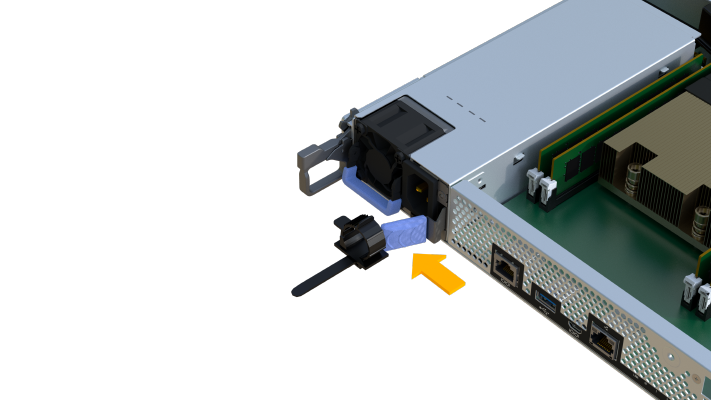

= 更换 EF300 或 EF600 电源
:allow-uri-read: 
:experimental: 
:icons: font
:imagesdir: ../media/

[role="lead"]
您可以更换 EF300 或 EF600 控制器中出现故障的电源。

如果某个电源发生故障，您必须尽快更换它，以使控制器架具有冗余电源。

.开始之前
* 查看 Recovery Guru 中的详细信息，确认电源有问题描述。从 Recovery Guru 中选择 * 重新检查 * ，以确保不需要先解决任何其他问题。
* 检查电源上的琥珀色警示 LED 是否亮起，表示电源或其集成风扇出现故障。
* 确保您已具备以下条件：
+
** 控制器架支持的替代电源。
** ESD 腕带，或者您已采取其他防静电预防措施。
** 一个管理工作站，其浏览器可访问控制器的 SANtricity 系统管理器。（要打开 System Manager 界面，请将浏览器指向控制器的域名或 IP 地址。）

== 第 1 步：卸下故障电源

卸下故障电源，以便更换为新的电源。

.步骤
. 拆开新电源的包装，将其放在驱动器架附近的水平表面上。
+
Save all packing materials for use when returning the failed power supply.

. 断开电源线：
+
.. 打开电源线固定器，然后从电源拔下电源线。
.. 从电源设备拔下电源线。

. 找到电源右侧的卡舌，然后将其推向电源设备。
+

. 找到电源正面的手柄。
. 使用把手将电源直接滑出系统。
+

CAUTION: When removing a power supply, always use two hands to support its weight.

+
image::../media/psup_3.png[PSUP 3.]

== 第 2 步：安装新的电源并完成更换

卸下故障电源后，安装一个新的电源。

.步骤
. Using both hands, support and align the edges of the power supply with the opening in the system chassis, and then gently push the power supply into the chassis using the cam handle.
+
The power supplies are keyed and can only be installed one way.

+

CAUTION: 将电源滑入系统时，请勿用力过大；否则可能会损坏连接器。

+
image::../media/psup_4.png[PSUP 4.]

. 确认其状态为最佳并检查控制器架的警示 LED 。
+
如果状态不是最佳状态，或者任何警示 LED 均亮起，请确认所有缆线均已正确就位，并且控制器箱已正确安装。如有必要，请拆下并重新安装控制器箱。

+

NOTE: 如果无法解决此问题，请联系技术支持。

. 在 SANtricity 系统管理器中，单击菜单：支持 [ 升级中心 ] 以确保已安装最新版本的 SANtricity OS 。
+
根据需要安装最新版本。

.下一步是什么？
电源更换已完成。您可以恢复正常操作。
