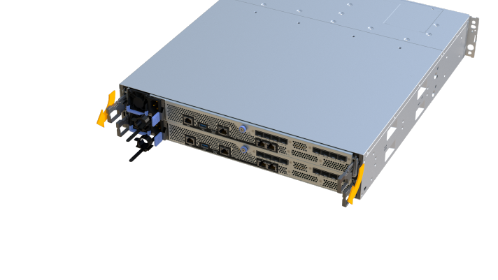

= 将 SAS 扩展卡添加到 EF300
:allow-uri-read: 
:experimental: 
:icons: font
:imagesdir: ../media/

[role="lead"]
您可以将 SAS 扩展卡添加到 EF300 控制器，以允许驱动器托盘扩展。

添加 SAS 扩展卡时，必须关闭存储阵列电源，安装新的 SAS 扩展卡并重新加电。

.开始之前
* 请查看 link:sas-overview-supertask-concept.html["更换 EF300 SAS 扩展卡的要求"]。
* 您必须为此操作步骤计划停机维护窗口。在成功完成此操作步骤之前，您无法访问存储阵列上的数据。

.您需要什么？ #8217 ；将需要什么
* 与控制器兼容的 SAS 扩展卡。
* ESD 腕带，或者您已采取其他防静电预防措施。
* 一个无静电的平面工作区。
* 1 号十字螺丝刀。
* 用于标识连接到控制器箱的每个缆线的标签。
* 一个管理工作站，其浏览器可访问控制器的 SANtricity 系统管理器。（要打开 System Manager 界面，请将浏览器指向控制器的域名或 IP 地址。）

== 第 1 步：使控制器架脱机

将控制器架置于脱机状态，以便可以安全地添加 SAS 扩展卡。

.步骤
. 在 SANtricity 系统管理器的主页页面中，确保存储阵列处于最佳状态。
+
如果状态不是最佳状态，请使用 Recovery Guru 或联系技术支持以解决此问题。请勿继续使用此操作步骤。

. 使用 SANtricity 系统管理器备份存储阵列的配置数据库。
+
如果删除控制器时出现问题，您可以使用保存的文件还原配置。系统将保存 RAID 配置数据库的当前状态，其中包括控制器上卷组和磁盘池的所有数据。

+
** 在 System Manager 中：
+
... 选择菜单： Support[ 支持中心 > 诊断 ] 。
... 选择 * 收集配置数据 * 。
... 单击 * 收集 * 。
+
此文件将保存在浏览器的 "Downloads" 文件夹中，名为 * configurationData-<arrayName>-<DateTime>.7z* 。

. 确保存储阵列与所有已连接主机之间未发生任何 I/O 操作。例如，您可以执行以下步骤：
+
** 停止涉及从存储映射到主机的 LUN 的所有进程。
** 确保没有应用程序向从存储映射到主机的任何 LUN 写入数据。
** 卸载与阵列上的卷关联的所有文件系统。
+

NOTE: 停止主机 I/O 操作的确切步骤取决于主机操作系统和配置，这些步骤不在本说明的范围之内。如果您不确定如何停止环境中的主机 I/O 操作，请考虑关闭主机。

+

CAUTION: * 可能的数据丢失 * - 如果在执行 I/O 操作时继续执行此操作步骤，则主机应用程序可能会因为无法访问存储而无法访问数据。

. 等待缓存中的所有数据写入驱动器。
+
当需要将缓存数据写入驱动器时，每个控制器背面的绿色缓存活动 LED 亮起。您必须等待此 LED 关闭。

. 从 SANtricity 系统管理器的主页页面中，选择 * 查看正在执行的操作 * 。等待所有操作完成，然后再继续下一步。
. 关闭控制器架。
+
.. 标记并拔下控制器架上的两根电源线。
.. 等待控制器架上的所有 LED 熄灭。

== 第 2 步：拆下控制器箱

卸下控制器箱，以便添加新的 SAS 扩展卡。

.步骤
. 戴上 ESD 腕带或采取其他防静电预防措施。
. 为连接到控制器箱的每个缆线贴上标签。
. 断开控制器箱的所有缆线。
+

CAUTION: To prevent degraded performance, do not twist, fold, pinch, or step on the cables.

. 确认控制器背面的缓存活动 LED 是否熄灭。
. 按压控制器两侧的手柄，然后向后拉，直到其从磁盘架中释放为止。
+

. 用两只手和把手将控制器箱滑出磁盘架。如果控制器的正面没有机箱，请用两只手将其完全拉出。
+

CAUTION: 始终用双手支撑控制器箱的重量。

+
image::../media/remove_controller_6.png[删除控制器 6]

. 将控制器箱放在无静电的平面上。

== 第 3 步：添加新的 SAS 扩展卡

安装 SAS 扩展卡以允许驱动器托盘扩展。

NOTE: 在 EF300 控制器架上， SAS 扩展卡只能安装在端口 1 中。

.步骤
. 拧下单个翼形螺钉并提起控制器箱盖，以卸下控制器箱盖。
. 确认控制器中的绿色 LED 是否熄灭。
+
如果此绿色 LED 亮起，则表示控制器仍在使用电池电源。您必须等待此 LED 熄灭，然后才能卸下任何组件。

. 使用 1 号十字螺丝刀卸下将面板连接到控制器箱的两个螺钉，然后卸下面板。
. 将 SAS 扩展卡上的单个翼形螺钉与控制器上的相应孔对齐，并将扩展卡底部的连接器与控制器卡上的扩展卡接口连接器对齐。
+
请注意，不要擦除或撞击 SAS 扩展卡底部或控制器卡顶部的组件。

. 小心地将 SAS 扩展卡放低到位，然后轻按扩展卡以固定扩展卡连接器。
. 手动拧紧 SAS 扩展卡翼形螺钉。
+
请勿使用螺丝刀，否则可能会过度拧紧螺钉。

. 使用 1 号十字螺丝刀，使用两个螺钉将从原始控制器箱上拆下的面板连接到新控制器箱。

== 第 4 步：重新安装控制器箱

安装新的 SAS 扩展卡后，将控制器箱重新安装到控制器架中。

.步骤
. 降低控制器箱上的盖板并固定翼形螺钉。
. 在挤压控制器把手的同时，将控制器箱轻轻滑入控制器架中。
+

NOTE: 正确安装到磁盘架后，控制器会发出卡嗒声。

+
image::../media/remove_controller_7.png[卸下控制器 7]

== 第 5 步：添加完 SAS 扩展卡

将控制器置于联机状态，收集支持数据并恢复操作。

.步骤
. 插入电源线以使控制器联机。
. 在控制器启动时，检查控制器 LED 。
+
** 琥珀色警示 LED 仍保持亮起状态。
** 主机链路 LED 可能亮起，闪烁或熄灭，具体取决于主机接口。

. 控制器恢复联机后，确认其状态为最佳，并检查控制器架的警示 LED 。
+
如果状态不是最佳状态，或者任何警示 LED 均亮起，请确认所有缆线均已正确就位，并且控制器箱已正确安装。如有必要，请拆下并重新安装控制器箱。

+

NOTE: 如果无法解决此问题，请联系技术支持。

. 单击菜单： Hardware[ 支持 > 升级中心 ] 以确保已安装最新版本的 SANtricity OS 。
+
根据需要安装最新版本。

. 验证所有卷是否均已返回到首选所有者。
+
.. 选择菜单： Storage[Volumes] 。在 * 所有卷 * 页面中，验证卷是否已分发到其首选所有者。选择菜单：更多 [ 更改所有权 ] 以查看卷所有者。
.. 如果卷全部归首选所有者所有，请继续执行步骤 6 。
.. 如果未返回任何卷，则必须手动返回这些卷。转到菜单：更多 [ 重新分配卷 ] 。
.. 如果在自动分发或手动分发后，只有部分卷返回给其首选所有者，则必须检查 Recovery Guru 以了解主机连接问题。
.. 如果不存在 Recovery Guru ，或者按照恢复 Guru 步骤执行操作，则卷仍不会返回到其首选所有者联系支持部门。

. 使用 SANtricity 系统管理器收集存储阵列的支持数据。
+
.. 选择菜单： Support[ 支持中心 > 诊断 ] 。
.. 选择 * 收集支持数据 * 。
.. 单击 * 收集 * 。
+
此文件将保存在浏览器的 "Downloads" 文件夹中，名为 * support-data.7z* 。

NOTE: 要为 SAS 扩展布线，请参见 link:../install-hw-cabling/index.html["为 E 系列硬件布线"] 有关说明，请参见。

在存储阵列中添加 SAS 扩展卡的过程已完成。您可以恢复正常操作。
