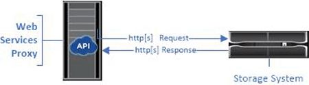

= API 基础知识
:allow-uri-read: 
:icons: font
:imagesdir: ../media/

[role="lead"]
在 Web 服务 API 中， HTTP 通信涉及请求响应周期。

== 请求中的 URL 元素

无论使用何种编程语言或工具，每次对 Web 服务 API 的调用都具有类似的结构，其中包含 URL ， HTTP 动词和接受标头。

如以下示例所示，所有请求都包含一个 URL ，并包含表中所述的元素。

` + https://webservices.name.com:8443/devmgr/v2/storage-systems+`

|===
| 区域 | Description 

 a| 
HTTP 传输

`https ： //`
 a| 
Web 服务代理支持使用 HTTP 或 HTTPS 。

出于安全原因，嵌入式 Web 服务需要 HTTPS 。

 a| 
基本 URL 和端口

`webservices.name.com:8443`
 a| 
每个请求都必须正确路由到 Web 服务的活动实例。需要提供实例的 FQDN （完全限定域名）或 IP 地址以及侦听端口。默认情况下， Web 服务通过端口 8080 （用于 HTTP ）和端口 8443 （用于 HTTPS ）进行通信。

对于 Web 服务代理，可以在代理安装期间或在 wsconfig.xml 文件中更改这两个端口。端口争用在运行各种管理应用程序的数据中心主机上很常见。

对于嵌入式 Web 服务，无法更改控制器上的端口；为了确保安全连接，默认为端口 8443 。

 a| 
API 路径

`devmgr/v2/storage-systems`
 a| 
向 Web 服务 API 中的特定 REST 资源或端点发出请求。大多数端点采用以下形式：

`devmgr/v2/< 资源 >/[id]`

API 路径包含三部分：

* `devmgr` （ Device Manager ）是 Web 服务 API 的命名空间。
* `v2` 表示要访问的 API 版本。您也可以使用 `utils` 访问登录端点。
* `s存储系统` 是文档中的一个类别。

|===

== 支持的 HTTP 动词

支持的 HTTP 动词包括 GET ， POST 和 DELETE ：

* 获取请求用于只读请求。
* POST 请求用于创建和更新对象，也用于可能涉及安全问题的读取请求。
* 删除请求通常用于从管理中删除对象，彻底删除对象或重置对象的状态。

NOTE: 目前， Web 服务 API 不支持 PUT 或修补程序。而是可以使用 POST 为这些动词提供典型功能。

== 接受标题

返回请求正文时， Web 服务将以 JSON 格式返回数据（除非另有说明）。某些客户端默认请求 "`text/html` " 或类似内容。在这些情况下， API 会以 HTTP 代码 406 进行响应，表示它无法提供此格式的数据。作为最佳实践，对于任何预期 JSON 为响应类型的情况，您应将 accept 标头定义为 "`application/json` " 。在其他未返回响应正文的情况下（例如， delete ），如果接受标头不会发生原因任何意外影响，则会返回相应正文。

== Responses

向 API 发出请求时，响应将返回两个关键信息：

* HTTP 状态代码—指示请求是否成功。
* 可选响应正文—通常提供一个 JSON 正文来表示资源的状态，或者提供一个正文来提供有关故障性质的更多详细信息。

您必须检查状态代码和内容类型标题，以确定生成的响应正文。对于 HTTP 状态代码 200-203 和 422 ， Web Services 将返回一个 JSON 正文并返回响应。对于其他 HTTP 状态代码， Web 服务通常不会返回额外的 JSON 正文，因为规范不允许返回（ 204 ），或者因为状态不言自明。下表列出了常见的 HTTP 状态代码和定义。它还指示是否在 JSON 正文中返回与每个 HTTP 代码关联的信息。

|===
| HTTP 状态代码 | Description | JSON 正文 

 a| 
200 正常
 a| 
表示响应成功。
 a| 
是的。

 a| 
已创建 201
 a| 
指示已创建对象。在极少数情况下会使用此代码，而不是 200 状态。
 a| 
是的。

 a| 
202 已接受
 a| 
表示已接受此请求并将其作为异步请求进行处理，但您必须随后发出请求才能获得实际结果。
 a| 
是的。

 a| 
203 非权威信息
 a| 
与 200 响应类似，但 Web 服务无法保证数据是最新的（例如，此时只能使用缓存的数据）。
 a| 
是的。

 a| 
204 无内容
 a| 
表示操作成功，但没有响应正文。
 a| 
否

 a| 
400 个错误请求
 a| 
指示请求中提供的 JSON 正文无效。
 a| 
否

 a| 
401 未授权
 a| 
指示发生身份验证失败。未提供凭据，或者用户名或密码无效。
 a| 
否

 a| 
403 已禁用
 a| 
授权失败，表示经过身份验证的用户无权访问请求的端点。
 a| 
否

 a| 
未找到 404
 a| 
指示找不到请求的资源。此代码适用于标识符请求的不存在 API 或不存在的资源。
 a| 
否

 a| 
422 不可处理实体
 a| 
表示请求格式通常良好，但输入参数无效或存储系统的状态不允许 Web 服务满足请求。
 a| 
是的。

 a| 
424 依赖关系失败
 a| 
用于在 Web 服务代理中指示请求的存储系统当前不可访问。因此， Web 服务无法满足此请求。
 a| 
否

 a| 
429 个请求太多
 a| 
表示已超过请求限制，应稍后重试。
 a| 
否

|===

== 示例脚本

GitHub 包含一个存储库，用于收集和组织展示 NetApp SANtricity Web 服务 API 使用的示例脚本。要访问存储库，请参见 https://github.com/NetApp/webservices-samples["NetApp Web 服务示例"^]。
